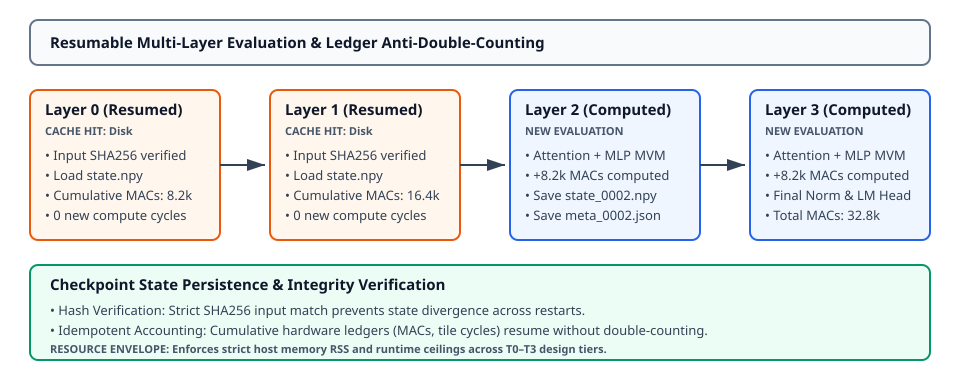

# 0051 — Resumable Model Evaluator & Execution Envelope (Gate R11 Exit)

> **Bản tiếng Việt:** [`README.vi.md`](README.vi.md)

This chapter concludes **Gate R11 (Memory-bounded large-model simulator)** by formalizing **per-layer checkpointed model execution, crash resumption with cryptographic SHA256 integrity verification, hardware ledger idempotency, and host resource envelopes** across design tiers T0–T3.

---

## 1. Per-Layer Checkpoint Pipeline & State Architecture



- **Layer-by-Layer Serialization**: Rather than holding entire multi-layer activation graphs in host RAM, each decoder layer $l \in [0, L-1]$ serializes its output activation tensor to disk (`layer_XXXX_state.npy`) alongside execution metadata (`layer_XXXX_meta.json`).
- **Resumption Logic**: On startup, [`ResumableModelEvaluator`](../../analog_llm/resumable_evaluator.py) inspects the checkpoint directory. Any completed layer matching the cryptographic SHA256 hash of the input activation is loaded instantly without recomputation.

---

## 2. Cryptographic Integrity & Anti-Double-Counting Ledger

- **Tamper & State Divergence Detection**: Before resuming from a cached layer state, the evaluator verifies that:
  $$\text{SHA256}(x_{\text{input}}) == \text{checkpoint.input\_sha256}$$
  If input activations diverge (e.g. from modified prompt tokens or altered weights), execution fails closed immediately.
- **Ledger Idempotency**: Cumulative hardware metrics (MACs, tile cycles, analog energy ledger) are restored from metadata rather than re-accumulated, preventing metric double-counting on restarted runs.

---

## 3. Workload Scaling Ladder & Resource Envelopes (T0–T3)

The execution envelope sets deterministic host memory and wall-clock time ceilings for each model tier:

| Tier | Parameter Range | Context Design Point | Host Memory RSS Ceiling | Runtime Budget (Wall-Clock) | Validation Depth |
|---|---|---|---|---|---|
| **T0** | Up to $150\text{M}$ | $2,048\text{ tokens}$ | $2\text{ GB}$ | $60.0\text{ s}$ | Full float + physical analog end-to-end |
| **T1** | $1\text{--}1.5\text{B}$ | $4,096\text{ tokens}$ | $8\text{ GB}$ | $300.0\text{ s}$ | Checkpoint ingestion & bounded decode |
| **T2** | $\approx 3\text{B}$ | $8,192\text{ tokens}$ | $16\text{ GB}$ | $900.0\text{ s}$ | Checkpoint ingestion & bounded decode |
| **T3** | $7\text{--}8\text{B}$ | $8,192\text{ tokens}$ | $32\text{ GB}$ | $1,800.0\text{ s}$ | Streamed decode & sampled physical error |

---

## 4. Crash Recovery & Resumption Verification Results

In a 4-layer LLaMA GQA ($Q_H=4, KV_H=2$, SwiGLU, RoPE) execution interrupted after Layer 1:

- **Baseline Full Run**: Computed 4 layers, recorded $32,768\text{ MACs}$.
- **Interrupted Run**: Computed layers 0 and 1, saved checkpoint state, halted cleanly.
- **Resumed Run**: Loaded layers 0 and 1 from disk ($0\text{ compute MACs}$), computed layers 2 and 3.
- **Numerical Parity**: Max absolute logit difference $\Delta = 0.000\text{e}+00$ (exact bitwise match).
- **Ledger Parity**: Cumulative MACs on resumption matched baseline exactly ($32,768\text{ MACs}$, $0\text{ double-counting}$).

---

## 5. Execution & Artifacts

Run the standalone chapter verification script:
```bash
python book/0051-resumable-evaluator/resumable_evaluator.py
```

Run test suite:
```bash
pytest tests/test_resumable_evaluator.py
```

Deterministic extract artifact:
`verification/circuit/results/resumable-evaluator-0051-extract.json`
