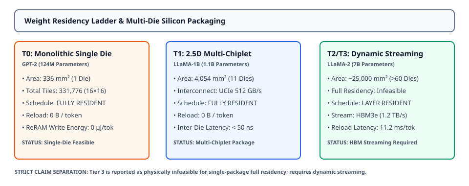

# 0052 — Weight Residency, Topology Exploration & Chiplet Scaling (Gate R12)

> **Bản tiếng Việt:** [`README.vi.md`](README.vi.md)

This chapter opens **Gate R12 (Large-model accelerator capacity and data movement)** by formalizing **physical crossbar tile capacity, differential cell pairing, silicon area scaling, and multi-die chiplet packaging feasibility** across workload tiers T0–T3.

---

## 1. Hardware Architecture & Crossbar Topology Scaling



- **Stationary Analog Crossbars**: Analog compute-in-memory achieves maximum energy efficiency when weight matrices remain stationary in non-volatile ReRAM conductances, avoiding runtime DRAM/HBM weight reloads.
- **Physical Silicon Limits**:
  - Standard reticle limit for a single die: $400.0\text{ mm}^2$.
  - Advanced 2.5D/3D interposer packaging limit: up to $12\text{ chiplets}$ connected via high-bandwidth UCIe ($512\text{ GB/s}$).
- **Strict Infeasibility Reporting**: Models exceeding packaging capacity (T2/T3) are explicitly reported as physically infeasible for full stationary residency rather than obscured behind unbounded memory assumptions.

---

## 2. Differential Tile Pairing & Silicon Area Formulation

Each signed matrix weight $W_{i,j}$ requires a differential pair of physical ReRAM cells ($G_{i,j}^+, G_{i,j}^-$) in a $16 \times 16$ tile:

$$N_{\text{tiles}} = \sum_{p \in \text{projections}} \left\lceil \frac{\text{out}_p}{16} \right\rceil \times \left\lceil \frac{\text{in}_p}{16} \right\rceil$$

$$A_{\text{silicon}} = \left(N_{\text{tiles}} \times 256 \times 2 \times p_{\text{cell}}^2\right) + \left(N_{\text{tiles}} \times A_{\text{peripheral}}\right)$$

Where cell pitch $p_{\text{cell}} = 160\text{ nm}$ (28nm BEOL ReRAM) and peripheral mixed-signal area $A_{\text{peripheral}} = 1000.0\ \mu\text{m}^2$ per tile (SAR ADC, DAC, TIA, and local sequencing).

---

## 3. Workload Ladder Residency & Silicon Area Breakdown (T0–T3)

| Tier / Model | Parameters | Analog Proj Params | Physical Tiles ($16 \times 16$) | Total Silicon Area | Chiplets Required | Full Residency Feasibility |
|---|---|---|---|---|---|---|
| **Hand-Calc ($2\text{L}$)** | $18.2\text{K}$ | $16.4\text{K}$ | $64$ | $0.1\text{ mm}^2$ | $1$ | **YES (Single Die)** |
| **T0 (GPT-2 124M)** | $124.4\text{M}$ | $84.9\text{M}$ | $331,776$ | $336.1\text{ mm}^2$ | $1$ | **YES (Single Die)** |
| **T1 (LLaMA-1B)** | $1.10\text{B}$ | $1.03\text{B}$ | $4,040,704$ | $4,093.7\text{ mm}^2$ | $11$ | **YES (11-Chiplet Package)** |
| **T2 (LLaMA-3B)** | $2.97\text{B}$ | $2.87\text{B}$ | $11,222,016$ | $11,369.1\text{ mm}^2$ | $29$ | **NO (Exceeds Package)** |
| **T3 (LLaMA-2 7B)** | $6.74\text{B}$ | $6.61\text{B}$ | $25,808,896$ | $26,147.2\text{ mm}^2$ | $66$ | **NO (Exceeds Package)** |

---

## 4. Schedule Comparison: Stationary vs Layer-Reload vs Streaming

| Schedule Strategy | Weight Reload / Token | Reload Latency / Token | ReRAM Write Energy / Token | Physical Viability Assessment |
|---|---|---|---|---|
| **`FULLY_RESIDENT`** | $0\text{ B}$ | $0.0\ \mu\text{s}$ | $0.0\ \mu\text{J}$ | **Feasible for T0 & T1**; eliminates DRAM memory wall. |
| **`LAYER_RESIDENT`** | $2.07\text{ GB}$ (T1) / $13.2\text{ GB}$ (T3) | $1.72\text{ ms}$ (T1) / $11.0\text{ ms}$ (T3) | $10.3\text{ mJ}$ (T1) / $66.1\text{ mJ}$ (T3) | Requires HBM3e ($1.2\text{ TB/s}$) & ReRAM endurance budget. |
| **`STREAMED_WEIGHT`** | $2.07\text{ GB}$ (T1) / $13.2\text{ GB}$ (T3) | $32.3\text{ ms}$ (T1) / $206.5\text{ ms}$ (T3) | $0.0\ \mu\text{J}$ (SRAM Buffer) | Bottlenecked by host PCIe Gen5 ($64\text{ GB/s}$). |

---

## 5. Execution & Artifacts

Run the standalone chapter verification script:
```bash
python book/0052-weight-residency-topology/residency_topology.py
```

Run test suite:
```bash
pytest tests/test_residency.py
```

Deterministic extract artifact:
`verification/circuit/results/residency-topology-0052-extract.json`
