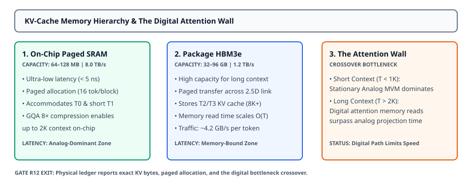

# 0053 — Phân Tầng KV-Cache, Phân Vùng Phân Trang & Bức Tường Attention Số (Hoàn Thành Gate R12)

> **English version:** [`README.md`](README.md)

Chương này khép lại **Gate R12 (Large-model accelerator capacity and data movement)** bằng việc chuẩn hóa **phân tầng bộ nhớ KV-cache, mở rộng nén GQA/MQA, cấp phát phân trang theo khối, và điểm nghẽn chuyển dịch của Bức Tường Attention Số (Digital Attention Wall)** trên các bậc thiết kế T0–T3.

---

## 1. Phân Tầng Bộ Nhớ Phân Trang & Bố Trí Đa Cấp



- **Ba Tầng Bộ Nhớ**:
  1. **SRAM Phân Trang Trên Chip ($64\text{--}128\text{ MB}$, $8.0\text{ TB/s}$)**: Độ trễ siêu thấp ($< 5\text{ ns}$), lưu trữ KV-cache cho T0 và T1 ngữ cảnh ngắn.
  2. **HBM3e Trên Package ($32\text{--}96\text{ GB}$, $1.2\text{ TB/s}$)**: Tầng dung lượng cao lưu trữ KV-cache cho T1 ngữ cảnh dài, T2 và T3 ($T \ge 4096$).
  3. **DRAM Của Host ($64\text{ GB/s}$ qua PCIe Gen5)**: Tầng dự phòng cho các chuỗi tràn vượt quá dung lượng package.
- **Cấp Phát Phân Trang (Paged Allocation)**: Các tensor KV được cấp phát theo từng khối $16\text{ token}$ để triệt tiêu phân mảnh bộ nhớ trong quá trình giải mã autoregressive độ dài biến đổi.

---

## 2. Công Thức Nén GQA/MQA & Dung Lượng Chiếm Dụng

Với mô hình có $L$ layer, $KV_H$ đầu key-value, kích thước mỗi đầu $d = H / Q_H$, chiều dài ngữ cảnh $T$, và $\text{dtype\_bytes} = 2$ ($\text{FP16}$):

$$M_{\text{KV}} = 2 \times L \times KV_H \times d \times T \times \text{dtype\_bytes}$$

$$\text{Hệ Số Nén GQA} = \frac{Q_H}{KV_H}$$

- **Multi-Head Attention (MHA)**: $KV_H = Q_H \implies 1.0\times$ dung lượng gốc.
- **Grouped-Query Attention (GQA)**: $1 < KV_H < Q_H$ (ví dụ $KV_H = 4, Q_H = 32 \implies \text{giảm } 8.0\times\text{ dung lượng}$).
- **Multi-Query Attention (MQA)**: $KV_H = 1 \implies \text{giảm } Q_H\times\text{ dung lượng}$.

---

## 3. Thang Đo Workload Quy Mô KV & Bố Trí Bộ Nhớ (T0–T3)

| Bậc Mô Hình | Kiến Trúc | Tỷ Lệ GQA | Ngữ Cảnh ($T$) | Dung Lượng KV | Tầng Lưu Trữ | Điểm Nghẽn Độ Trễ Chính |
|---|---|---|---|---|---|---|
| **Hand-Calc ($2\text{L}$)** | GQA ($4/2$) | $2.0\times$ | $64$ | $8.0\text{ KB}$ | `on_chip_sram` | MVM Analog ($15.0\ \mu\text{s}$) |
| **T0 (GPT-2 124M)** | MHA ($12/12$) | $1.0\times$ | $1,024$ | $36.0\text{ MB}$ | `on_chip_sram` | MVM Analog ($15.0\ \mu\text{s}$) |
| **T1 (LLaMA-1B)** | GQA ($32/4$) | $8.0\times$ | $2,048$ | $44.0\text{ MB}$ | `on_chip_sram` | MVM Analog ($15.0\ \mu\text{s}$) |
| **T1 (LLaMA-1B)** | GQA ($32/4$) | $8.0\times$ | $4,096$ | $88.0\text{ MB}$ | `package_hbm` | **Bức Tường Attention Số** ($73.4\ \mu\text{s}$) |
| **T2 (LLaMA-3B)** | GQA ($32/8$) | $4.0\times$ | $8,192$ | $672.0\text{ MB}$ | `package_hbm` | **Bức Tường Attention Số** ($560.1\ \mu\text{s}$) |
| **T3 (LLaMA-2 7B)** | MHA ($32/32$) | $1.0\times$ | $8,192$ | $4,096.0\text{ MB}$ | `package_hbm` | **Bức Tường Attention Số** ($3,413.5\ \mu\text{s}$) |

---

## 4. Bức Tường Attention Số & Phân Tích Điểm Chuyển Giao Điểm Nghẽn

Tính toán trong bộ nhớ analog thực thi các phép chiếu tuyến tính ở độ trễ chu kỳ $\mathcal{O}(1)$ cố định. Tuy nhiên, phép tính attention nhân quả giữa các token vẫn hoàn toàn xử lý bằng số ($Q K^T + \text{Softmax} + \text{Attn} V$):

$$\text{Độ Trễ}_{\text{số}} = \frac{2 \times T \times H \times L \times 2}{\text{TFLOPS}_{\text{số}}} + \frac{M_{\text{KV}}(T)}{\text{Băng Thông}_{\text{bộ nhớ}}}$$

- **Giai Đoạn Analog Chi Phối ($T < T_{\text{crossover}}$)**: Khi KV-cache vừa trong SRAM băng thông siêu rộng trên chip ($8.0\text{ TB/s}$), độ trễ attention số chỉ $< 10\ \mu\text{s}$, và MVM analog cố định chi phối thời gian giải mã.
- **Giai Đoạn Bức Tường Attention ($T > T_{\text{crossover}}$)**: Khi ngữ cảnh kéo dài, KV-cache tràn xuống HBM ($1.2\text{ TB/s}$). Lưu lượng đọc bộ nhớ ($\mathcal{O}(T)$) và số phép tính attention số ($\mathcal{O}(T)$ khi decode, $\mathcal{O}(T^2)$ khi prefill) vượt qua thời gian tính toán của crossbar.
- **Kết Luận Hệ Thống**: Gia tốc MVM analog đơn thuần không thể mở rộng hiệu năng cho ngữ cảnh dài nếu không có bộ đồng xử lý attention số băng thông cao kết hợp kỹ thuật nén GQA triệt để.

---

## 5. Thực Thi & Artifacts

Chạy script kiểm tra độc lập của chương:
```bash
python book/0053-kv-cache-hierarchy/kv_cache_hierarchy.py
```

Chạy bộ unit test:
```bash
pytest tests/test_kv_hierarchy.py
```

File trích xuất artifact:
`verification/circuit/results/kv-hierarchy-0053-extract.json`
