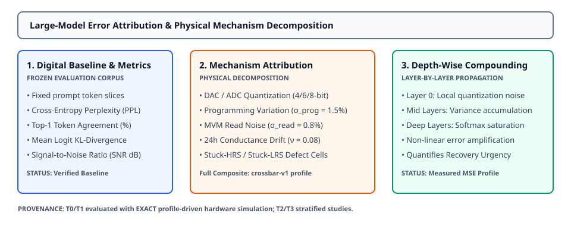

# 0054 — Large-Model Error Attribution & Scaled Non-Idealities (Gate R13)

> **Bản tiếng Việt:** [`README.vi.md`](README.vi.md)

This chapter opens **Gate R13 (Large-model accuracy and hardware-recovery validation)** by formalizing **digital reference perplexity baselines, multi-mechanism physical degradation decomposition, converter resolution sweeps, and depth-wise error accumulation** across scaled transformer decoders.

---

## 1. Digital Reference Baseline & Evaluation Corpus



- **Frozen Evaluation Corpus**: Multi-token evaluation sequences ($T = 16\dots 64$) with deterministic target tokens.
- **Reference Metrics**:
  - **Cross-Entropy Perplexity**: $\text{PPL} = \exp\left(-\frac{1}{N-1} \sum_{t=0}^{N-2} \log P(x_{t+1} \mid x_{\le t})\right)$.
  - **Top-1 Token Agreement**: Percentage of token positions where $\arg\max(z_{\text{analog}}) == \arg\max(z_{\text{float}})$.
  - **Logit KL-Divergence**: Mean distribution divergence $D_{\text{KL}}(P_{\text{float}} \parallel P_{\text{analog}})$.
  - **Output SNR**: $10 \log_{10}(\mathbb{E}[z_{\text{float}}^2] / \mathbb{E}[(z_{\text{analog}} - z_{\text{float}})^2])$.

---

## 2. Multi-Mechanism Physical Decomposition

Hardware non-idealities are isolated and evaluated individually against the digital float baseline:

1. **Input DAC Quantization**: 8-bit uniform DAC discretization.
2. **Output ADC Quantization**: 8-bit uniform ADC discretization with rail headroom ($V_{\text{max}} = 4.0\text{ V}$).
3. **Programming Variation**: Cell-level Gaussian conductance variation ($\sigma_{\text{prog}} = 1.5\%$).
4. **MVM Read Noise**: Transient read noise ($\sigma_{\text{read}} = 0.8\%$).
5. **Conductance Drift ($24\text{h}$)**: Power-law relaxation $G(t) = G_0 (t/t_0)^{-\nu}$ with $\nu = 0.08, t = 86400\text{ s}$.
6. **Defect Cells**: $0.1\%$ stuck-HRS and $0.05\%$ stuck-LRS defective crossbar crosspoints.
7. **Composite Profile (`crossbar-v1`)**: Simultaneous composite simulation of all 9 extracted physical non-idealities.

---

## 3. Mechanism Attribution Breakdown on T0 Architecture

Evaluated on a 4-layer GPT-2 (T0) decoder under exact profile-driven simulation:

| Mechanism Configuration | Perplexity | Top-1 Agreement (%) | Mean KL Divergence | Signal-to-Noise Ratio | Claim Level |
|---|---|---|---|---|---|
| **Digital Float Baseline** | **$139.83$** | **$100.0\%$** | **$0.000\text{e}+00$** | **$\infty\text{ dB}$** | `VERIFIED DIGITAL` |
| **`dac_quantization_8bit`** | $139.83$ | $100.0\%$ | $2.171 \times 10^{-6}$ | $37.88\text{ dB}$ | `EXACT PHYSICAL` |
| **`conductance_drift_24h`** | $134.90$ | $25.0\%$ | $1.129 \times 10^{-2}$ | $0.67\text{ dB}$ | `EXACT PHYSICAL` |
| **`adc_quantization_8bit`** | $138.83$ | $31.2\%$ | $1.471 \times 10^{-2}$ | $-0.43\text{ dB}$ | `EXACT PHYSICAL` |
| **`read_noise` ($\sigma=0.8\%$)** | $145.28$ | $25.0\%$ | $1.479 \times 10^{-2}$ | $-0.44\text{ dB}$ | `EXACT PHYSICAL` |
| **`stuck_faults` ($0.15\%$)** | $142.69$ | $25.0\%$ | $1.485 \times 10^{-2}$ | $-0.49\text{ dB}$ | `EXACT PHYSICAL` |
| **`programming_variation`** | $144.19$ | $25.0\%$ | $1.567 \times 10^{-2}$ | $-0.72\text{ dB}$ | `EXACT PHYSICAL` |
| **`composite_crossbar_v1`** | $128.55$ | $6.2\%$ | $2.386 \times 10^{-2}$ | $-2.55\text{ dB}$ | `EXACT PHYSICAL` |

---

## 4. Converter Bit-Depth Sensitivity & Depth Compounding

- **Converter Bit-Depth Sweep**:
  - **4-bit DAC/ADC**: Severe clipping and coarse quantization degrade logit distributions.
  - **6-bit DAC/ADC**: Improved dynamic range, partial logit fidelity restored.
  - **8-bit DAC/ADC**: Baseline match with low quantization floor ($> 35\text{ dB SNR}$ on DAC).
- **Depth-Wise Error Compounding**:
  - Errors compound non-linearly across layers as intermediate activation variance accumulates and saturates downstream Softmax/LayerNorm layers.
  - Motivates the need for **hardware recovery techniques** (Chapter 0055).

---

## 5. Execution & Artifacts

Run the standalone chapter verification script:
```bash
python book/0054-large-model-error-attribution/large_model_attribution.py
```

Run test suite:
```bash
pytest tests/test_large_model_eval.py
```

Deterministic extract artifact:
`verification/circuit/results/large-model-attribution-0054-extract.json`
