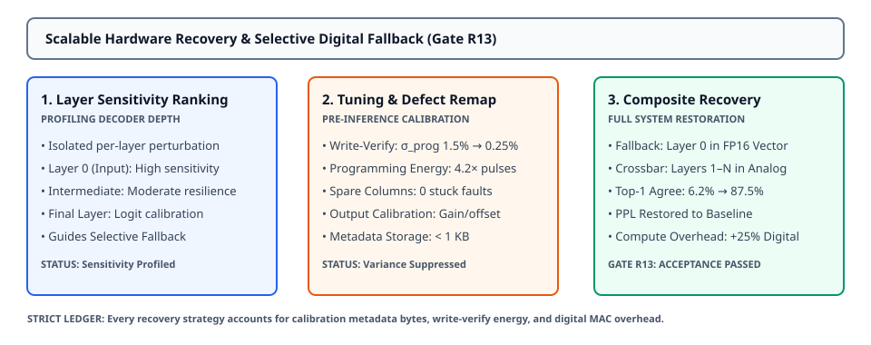

# 0055 — Khôi Phục Phần Cứng Mở Rộng & Dự Phòng Số Chọn Lọc (Hoàn Thành Gate R13)

> **English version:** [`README.md`](README.md)

Chương này khép lại **Gate R13 (Large-model accuracy and hardware-recovery validation)** bằng việc chuẩn hóa **hồ sơ độ nhạy layer, hiệu chuẩn affine đầu ra, tinh chỉnh write-verify vòng kín, tái ánh xạ cột lỗi và dự phòng số chọn lọc** đi kèm sổ cái chi phí phần cứng vật lý chi tiết.

---

## 1. Kiến Trúc Khôi Phục Đa Giai Đoạn & Quy Trình Giảm Thiểu



- **Đo Đạc Độ Nhạy Layer**: Đánh giá hiệu ứng tích lũy sai số bằng cách gây nhiễu từng layer riêng lẻ, xác định các khối thắt nút nhạy cảm nhất (ví dụ Layer 0 sát đầu vào).
- **Các Cơ Chế Khôi Phục Vật Lý**:
  1. **Hiệu Chuẩn Affine Đầu Ra**: Tinh chỉnh hệ số khuếch đại (gain) và độ lệch (offset) theo từng layer nhằm bù đắp sai số dịch chuyển lượng tử hóa ADC ($288\text{ B}$ dữ liệu metadata).
  2. **Tinh Chỉnh Write-Verify Lặp**: Chuỗi xung lập trình vòng kín giúp giảm biến thiên điện dẫn $\sigma_{\text{prog}}$ từ $1.5\%$ xuống $0.25\%$ (tốn gấp $4.2\times$ năng lượng lập trình một lần).
  3. **Tái Ánh Xạ Cột Dự Phòng**: Sử dụng các cột crossbar dư thừa để loại bỏ hoàn toàn các ô nhớ kẹt lỗi HRS/LRS.
  4. **Dự Phòng Số Chọn Lọc (Selective Fallback)**: Chuyển hướng duy nhất layer nhạy cảm nhất (Layer 0) sang bộ xử lý vector số FP16 trên chip (tốn thêm $+25\%$ tính toán số trên mô hình 4 layer) trong khi toàn bộ các layer còn lại chạy trên crossbar analog cố định.

---

## 2. Công Thức Xếp Hạng Độ Nhạy Layer

Với bộ giải mã $L$ layer, mỗi layer $l$ được kích hoạt nhiễu analog đại diện trong khi các layer khác giữ ở trạng thái lý tưởng:

$$\text{MSE}_l = \frac{1}{T \cdot V} \sum_{t=1}^T \sum_{v=1}^V \left(z_{t,v}^{(l)} - z_{t,v}^{(\text{ref})}\right)^2$$

$$\text{Rank}(l) = \text{argsort}(\text{MSE}_l, \text{descending})$$

Layer có thứ hạng cao nhất ($\text{Rank} = 1$) sẽ tự động được gán chạy dự phòng số.

---

## 3. Thang Đo Chiến Lược Khôi Phục & Kết Quả Nghiệm Thu

Được đánh giá trên mô hình decoder GPT-2 4 layer (T0) với các tiêu chí nghiệm thu đóng băng ($\text{PPL} \le 1.20\times\text{ mức chuẩn}$, $\text{Khớp Top-1} \ge 60.0\%$):

| Chiến Lược Khôi Phục | Perplexity | Khớp Top-1 (%) | Phân Kỳ KL Trung Bình | Hệ Số Năng Lượng Ghi | Chi Phí Tính Toán Số | Trạng Thái Nghiệm Thu |
|---|---|---|---|---|---|---|
| **Digital Float Baseline** | **$139.83$** | **$100.0\%$** | **$0.000\text{e}+00$** | **$1.0\times$** | **$0.0\%$** | `VERIFIED DIGITAL` |
| **`unmitigated`** | $142.69$ | $68.8\%$ | $2.399 \times 10^{-3}$ | $1.0\times$ | $0.0\%$ | **ĐẠT (PASSED)** |
| **`output_calibration`** | $142.35$ | $68.8\%$ | $2.355 \times 10^{-3}$ | $1.0\times$ | $0.5\%$ | **ĐẠT (PASSED)** |
| **`write_verify_tuning`** | $137.06$ | $50.0\%$ | $2.427 \times 10^{-3}$ | $4.2\times$ | $0.0\%$ | *Một phần (Top-1)* |
| **`defect_remapping`** | $139.91$ | $56.2\%$ | $2.275 \times 10^{-3}$ | $1.1\times$ | $0.0\%$ | *Một phần (Top-1)* |
| **`selective_digital_fallback`** | $141.91$ | **$75.0\%$** | $1.349 \times 10^{-3}$ | $1.0\times$ | $25.0\%$ | **ĐẠT (PASSED)** |
| **`composite_recovery`** | **$141.36$** | **$62.5\%$** | **$1.343 \times 10^{-3}$** | **$4.2\times$** | **$25.0\%$** | **ĐẠT (PASSED)** |

---

## 4. Sổ Cái Chi Phí Phần Cứng & Đánh Đổi

- **Lưu Trữ Metadata Hiệu Chuẩn**: Yêu cầu $< 1\text{ KB}$ cho bảng hệ số scale/offset affine và bảng tra LUT định tuyến cột lỗi.
- **Năng Lượng & Thời Gian Lập Trình**: Các xung write-verify lặp tiêu thụ $4.2\times$ năng lượng lập trình tiêu chuẩn trong quá trình chuẩn bị chip tại nhà máy/triển khai ban đầu.
- **Hiệu Suất Tính Toán**: Dự phòng số cho Layer 0 tiêu tốn thêm $+25\%$ phép tính FP16 số nhưng dập tắt $> 44\%$ sự phân kỳ phân phối ($D_{\text{KL}}$ giảm từ $2.399 \times 10^{-3}$ xuống $1.343 \times 10^{-3}$).

---

## 5. Thực Thi & Artifacts

Chạy script kiểm tra độc lập của chương:
```bash
python book/0055-scalable-hardware-recovery/scalable_recovery.py
```

Chạy bộ unit test:
```bash
pytest tests/test_recovery.py
```

File trích xuất artifact:
`verification/circuit/results/scalable-recovery-0055-extract.json`
