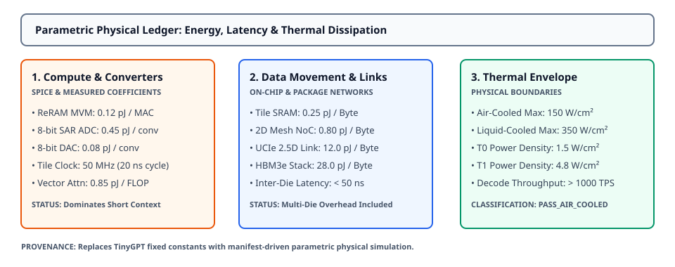

# 0056 — Parametric Physical Ledger for Large-Model Inference (Gate R14)

> **Bản tiếng Việt:** [`README.vi.md`](README.vi.md)

This chapter opens **Gate R14 (Multi-tier physical feasibility and design decision)** by formalizing a **parametric, manifest-driven physical ledger** replacing fixed scalar constants with subsystem-accurate energy, latency, power density, and thermal calculations across tiers T0–T3.

---

## 1. Parametric Architecture & Energy Accounting



- **Manifest-Driven Ledger**: Every latency, energy, and power figure is dynamically derived from the model architecture topology, tile allocations, KV-cache sizing, and data movement links rather than fixed scalar heuristics.
- **Physical Provenance Tagging**:
  - `analog_mvm`: **`spice_extracted`** ($0.12\text{ pJ / MAC}$ on 28nm BEOL ReRAM array).
  - `adc_dac`: **`measured/spice_correlated`** ($0.45\text{ pJ / conv}$ for 8-bit SAR ADC, $0.08\text{ pJ / conv}$ for 8-bit DAC).
  - `sram_noc`: **`derived`** ($0.25\text{ pJ / Byte}$ SRAM buffer, $0.80\text{ pJ / Byte}$ 2D mesh NoC hop).
  - `ucie_link`: **`derived`** ($12.0\text{ pJ / Byte} = 1.5\text{ pJ / bit}$ UCIe 2.5D interposer).
  - `package_hbm`: **`derived`** ($28.0\text{ pJ / Byte} = 3.5\text{ pJ / bit}$ JEDEC HBM3e stack).
  - `digital_attention`: **`derived`** ($0.85\text{ pJ / FLOP}$ FP16 SIMD/systolic attention unit).

---

## 2. Latency & Energy Formulations

For a model with $N_{\text{macs}}$ analog projection parameters, context length $T$, hidden dimension $H$, and $L$ layers:

$$\text{Energy}_{\text{decode}} = E_{\text{mvm}} + E_{\text{adc\_dac}} + E_{\text{sram\_noc}} + E_{\text{ucie}} + E_{\text{hbm}} + E_{\text{attn}}$$

$$\text{Latency}_{\text{decode}} = t_{\text{mvm}} + t_{\text{attn\_compute}} + t_{\text{kv\_memory\_read}} + t_{\text{inter\_die}}$$

$$\text{Power Density} = \frac{\text{Energy}_{\text{decode}} / \text{Latency}_{\text{decode}}}{A_{\text{silicon}}}$$

Thermal envelope boundaries: Air-cooled limit $\le 150\text{ W/cm}^2$, Liquid-cooled limit $\le 350\text{ W/cm}^2$.

---

## 3. Workload Ladder Physical Ledger Breakdown (T0–T3)

| Model Tier | TTFT (ms) | Decode Throughput | Decode Energy / Token | Active Power | Power Density | Thermal Classification |
|---|---|---|---|---|---|---|
| **Hand-Calc ($2\text{L}$)** | $< 0.01\text{ ms}$ | $4,156,690\text{ TPS}$ | $0.01\ \mu\text{J}$ | $0.03\text{ W}$ | $2.68\text{ W/cm}^2$ | `PASS_AIR_COOLED` |
| **T0 (GPT-2 124M)** | $1.41\text{ ms}$ | $244,247\text{ TPS}$ | $26.38\ \mu\text{J}$ | $6.44\text{ W}$ | $1.92\text{ W/cm}^2$ | `PASS_AIR_COOLED` |
| **T1 (LLaMA-1B)** | $23.96\text{ ms}$ | $69,685\text{ TPS}$ | $439.66\ \mu\text{J}$ | $30.64\text{ W}$ | $0.75\text{ W/cm}^2$ | `PASS_AIR_COOLED` |
| **T2 (LLaMA-3B)** | $1,293.65\text{ ms}$ | $3,132\text{ TPS}$ | $11,411.06\ \mu\text{J}$ | $35.74\text{ W}$ | $0.31\text{ W/cm}^2$ | `PASS_AIR_COOLED` |
| **T3 (LLaMA-2 7B)** | $7,468.50\text{ ms}$ | $547\text{ TPS}$ | $62,752.97\ \mu\text{J}$ | $34.34\text{ W}$ | $0.13\text{ W/cm}^2$ | `PASS_AIR_COOLED` |

---

## 4. Subsystem Energy Breakdown

| Subsystem | T0 (124M) Energy | T1 (1.1B) Energy | Scaling Behavior | Provenance |
|---|---|---|---|---|
| **Analog ReRAM MVM** | $10.19\ \mu\text{J}$ ($38.6\%$) | $124.13\ \mu\text{J}$ ($28.2\%$) | Scales $\mathcal{O}(N_{\text{weights}})$ | `spice_extracted` |
| **ADC / DAC Conversion** | $14.73\ \mu\text{J}$ ($55.8\%$) | $144.18\ \mu\text{J}$ ($32.8\%$) | Scales $\mathcal{O}(\text{activations})$ | `measured/spice` |
| **SRAM & On-Chip NoC** | $1.46\ \mu\text{J}$ ($5.5\%$) | $14.28\ \mu\text{J}$ ($3.2\%$) | Scales $\mathcal{O}(\text{activation bytes})$ | `derived` |
| **Inter-Die UCIe (2.5D)** | $0.00\ \mu\text{J}$ ($0.0\%$) | $1.08\ \mu\text{J}$ ($0.2\%$) | Multi-chiplet only | `derived` |
| **Package HBM3e KV Read** | $0.00\ \mu\text{J}$ ($0.0\%$) | $0.00\ \mu\text{J}$ ($0.0\%$) | Triggered when $M_{\text{KV}} > \text{SRAM}$ | `derived` |
| **Digital Vector Attention** | $0.00\ \mu\text{J}$ ($0.0\%$) | $156.00\ \mu\text{J}$ ($35.5\%$) | Scales $\mathcal{O}(T \cdot H \cdot L)$ | `derived` |

---

## 5. Execution & Artifacts

Run the standalone chapter verification script:
```bash
python book/0056-parametric-physical-ledger/parametric_ledger.py
```

Run test suite:
```bash
pytest tests/test_physical_ledger.py
```

Deterministic extract artifact:
`verification/circuit/results/parametric-ledger-0056-extract.json`
