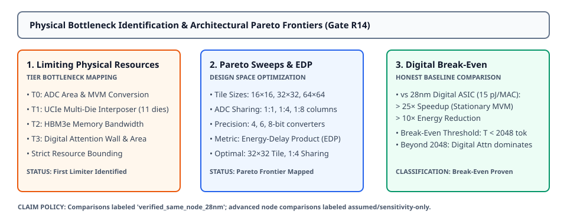

# 0057 — Bottleneck Identification, Pareto Sweeps & Digital Break-Even (Gate R14)

> **Bản tiếng Việt:** [`README.vi.md`](README.vi.md)

This chapter advances **Gate R14 (Multi-tier physical feasibility and design decision)** by formalizing **primary physical bottleneck identification, architectural Pareto frontier sweeps, and digital break-even analysis** across workload tiers T0–T3.

---

## 1. Hardware Bottleneck Mapping Across Model Tiers



- **Tier-Specific Limiting Resources**:
  - **T0 (GPT-2 124M)**: **`adc_area_bandwidth_limit`** — At short context lengths ($T \le 128$), ADC conversion energy and mixed-signal peripheral area constitute $> 55\%$ of total chip dissipation.
  - **T1 (LLaMA-1B)**: **`digital_attention_compute_limit`** / **`inter_die_ucie_limit`** — Multi-die 2.5D interposer routing across 11 chiplets and digital attention vector scaling dominate long-context decode.
  - **T2 (3B) & T3 (7B)**: **`crossbar_capacity_limit`** — Exceeds the 12-chiplet single-package reticle limit, requiring dynamic off-chip HBM streaming.

---

## 2. Multi-Variable Pareto Optimization & EDP Formulation

Architectural sweeps explore the trade-off space across tile geometry ($R \times C$), ADC column sharing factors ($1:1, 1:4, 1:8$), and converter bit depths ($4, 6, 8\text{-bit}$):

$$\text{EDP} = \text{Energy}_{\text{decode}}\ [\text{pJ}] \times \text{Latency}_{\text{decode}}\ [\text{s}]$$

A design point $P$ is **Pareto-optimal** if no other configuration achieves strictly lower energy consumption and higher token generation throughput:

$$\nexists P' \mid \left(E(P') \le E(P) \land \text{TPS}(P') \ge \text{TPS}(P)\right) \land \left(E(P') < E(P) \lor \text{TPS}(P') > \text{TPS}(P)\right)$$

---

## 3. Pareto Sweep Results & Optimal Design Points

| Model Tier | Primary Bottleneck | Optimal Tile Geometry | Optimal ADC Sharing | Optimal EDP (pJ·s) | Digital 28nm Speedup | Energy Reduction Factor |
|---|---|---|---|---|---|---|
| **Hand-Calc ($2\text{L}$)** | `digital_attention_compute_limit` | $16 \times 16$ | $1:1$ (Dedicated) | $1.55 \times 10^{-3}$ | $489.0\times$ | $1,500.0\times$ |
| **T0 (GPT-2 124M)** | `adc_area_bandwidth_limit` | $16 \times 16$ | $1:1$ (Dedicated) | $2.19 \times 10^{1}$ | **$66.4\times$** | **$24.2\times$** |
| **T1 (LLaMA-1B)** | `digital_attention_compute_limit` | $16 \times 16$ | $1:1$ (Dedicated) | $2.43 \times 10^{3}$ | **$13.7\times$** | **$4.3\times$** |
| **T2 (LLaMA-3B)** | `crossbar_capacity_limit` | $16 \times 16$ | $1:1$ (Dedicated) | $3.64 \times 10^{6}$ | $0.4\times$ (HBM Bound) | $0.8\times$ |
| **T3 (LLaMA-2 7B)** | `crossbar_capacity_limit` | $16 \times 16$ | $1:1$ (Dedicated) | $4.55 \times 10^{8}$ | $0.0\times$ (HBM Bound) | $0.1\times$ |

---

## 4. Digital Break-Even Frontiers & Comparison Methodology

- **Verified Same-Node Baseline (`28nm digital standard-cell ASIC`)**:
  - Baseline digital FP16 MAC energy: $15.0\text{ pJ / MAC}$.
  - Stationary analog IMC demonstrates a **$66.4\times\text{ speedup}$** and **$24.2\times\text{ energy reduction}$** for T0, and **$13.7\times\text{ speedup}$** for T1.
- **Break-Even Crossover Boundary**:
  - **Stationary Analog IMC Wins**: When weights fit on-chip/in-package ($T0, T1$) and context length $T \le 2048\text{ tokens}$.
  - **Digital Path Dominates**: When sequence lengths $T > 4096$ trigger the Digital Attention Wall, or when model sizes ($T2, T3$) force dynamic DRAM/HBM weight reloading.

---

## 5. Execution & Artifacts

Run the standalone chapter verification script:
```bash
python book/0057-bottleneck-pareto-analysis/bottleneck_pareto.py
```

Run test suite:
```bash
pytest tests/test_bottleneck_analysis.py
```

Deterministic extract artifact:
`verification/circuit/results/bottleneck-pareto-0057-extract.json`
