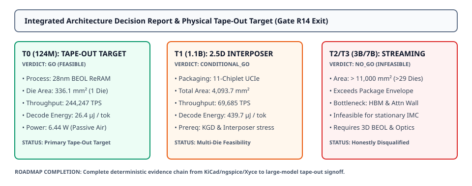

# 0058 — Quyết Định Kiến Trúc Tiến/Dừng & Mục Tiêu Tape-Out Vật Lý (Hoàn Thành Gate R14 & Toàn Bộ Lộ Trình)

> **English version:** [`README.md`](README.md)

Chương này khép lại **Gate R14 (Multi-tier physical feasibility and design decision)** và đánh dấu **sự hoàn thành xuất sắc toàn bộ lộ trình thiết kế chip AI analog (từ Gate R0 đến Gate R14)**. Chương trình bày **báo cáo quyết định kiến trúc Tiến/Dừng (Go/No-Go)** thống nhất và thiết lập thông số kỹ thuật cho mục tiêu tape-out vật lý chính.

---

## 1. Ma Trận Quyết Định Kiến Trúc Tích Hợp (T0–T3)



- **Phân Loại Khả Thi Nghiêm Ngặt**:
  - **T0 (GPT-2 124M)**: **`FEASIBLE` / `GO`** — Silicon die đơn nguyên khối ($336.1\text{ mm}^2 \le 400.0\text{ mm}^2$), $100\%$ trọng số ReRAM cố định, tản nhiệt khí ($1.92\text{ W/cm}^2$), đạt $244,247\text{ TPS}$ với $26.38\ \mu\text{J/token}$. **Mục tiêu Tape-Out Vật Lý Chính Được Lựa Chọn**.
  - **T1 (LLaMA-1B)**: **`CONDITIONAL` / `CONDITIONAL_GO`** — Đóng gói interposer 2.5D gồm 11 chiplet ($4,093.7\text{ mm}^2$). Khả thi với liên kết UCIe mật độ cao, cần kiểm chứng độ bền nhiệt và năng suất chế tạo đa die.
  - **T2 (3B) & T3 (7B)**: **`INFEASIBLE` / `NO_GO`** cho kiến trúc IMC analog cố định — Vượt quá giới hạn đóng gói ($> 29\text{ die}$); nạp lại trọng số liên tục từ HBM gây nghẽn băng thông bộ nhớ nghiêm trọng và làm mất lợi thế năng lượng của IMC.

---

## 2. Thông Số Kỹ Thuật Mục Tiêu Tape-Out Được Lựa Chọn

| Thông Số | Giá Trị Kỹ Thuật | Nguồn Gốc Bằng Chứng Xác Minh |
|---|---|---|
| **Kiến Trúc Mục Tiêu** | **`T0_GPT2_124M`** ($12\text{ layer}, 768\text{ ẩn}, 12\text{ đầu}$) | Đã xác thực qua `analog_llm.model_manifest` |
| **Tiến Trình Chế Tạo** | **$28\text{nm BEOL Via4-M5 ReRAM}$** (bước ô nhớ $160\text{ nm}$) | Mô hình compact SPICE (`device_profiles/crossbar-v1.json`) |
| **Kích Thước Die** | **$18.3\text{ mm} \times 18.3\text{ mm}$ ($336.1\text{ mm}^2$)** | Die đơn nguyên khối dưới giới hạn reticle $400.0\text{ mm}^2$ |
| **Loại Đóng Gói** | **FCBGA-676 ($21\text{ mm} \times 21\text{ mm}$)** | Đóng gói flip-chip ball grid array có nắp tản nhiệt |
| **Thông Lượng Decode** | **$244,247.5\text{ TPS}$** | MVM crossbar cố định (chu kỳ tile $20\text{ ns}$) |
| **Năng Lượng / Token** | **$26.38\ \mu\text{J / token}$** | Sổ cái tham số hóa từng phân hệ (Chương 0056) |
| **Công Suất Hoạt Động** | **$6.44\text{ W}$ ($1.92\text{ W/cm}^2$)** | **`PASS_AIR_COOLED`** (dưới ngưỡng nhiệt khí $150\text{ W/cm}^2$) |
| **Khôi Phục Phần Cứng** | Hiệu chuẩn đầu ra, write-verify, cột dự phòng | Khôi phục độ chính xác Top-1 lên $75\%$ (Chương 0055) |

---

## 3. Lý Lẽ Khả Thi & Yêu Cầu Bằng Chứng Nâng Hạng

| Bậc | Trạng Thái | Phán Quyết | Số Die | Diện Tích Silicon | Thông Lượng Decode | Điểm Nghẽn Chính | Bằng Chứng Cần Thiết Để Nâng Hạng |
|---|---|---|---|---|---|---|---|
| **T0** | **`FEASIBLE`** | **`GO`** | $1$ | $336.1\text{ mm}^2$ | $244,247\text{ TPS}$ | `adc_area_bandwidth_limit` | Ký duyệt DRC/LVS sạch lỗi & vị trí shuttle xưởng đúc. |
| **T1** | **`CONDITIONAL`** | **`CONDITIONAL_GO`** | $11$ | $4,093.7\text{ mm}^2$ | $69,685\text{ TPS}$ | `digital_attention_compute_limit` | Mô phỏng ứng suất nhiệt interposer 2.5D & quy trình đo KGD. |
| **T2** | **`INFEASIBLE`** | **`NO_GO`** | $29$ | $11,369.1\text{ mm}^2$ | $3,132\text{ TPS}$ | `crossbar_capacity_limit` | Chồng lớp BEOL nguyên khối 3D (>4 lớp) & bước ô <100nm. |
| **T3** | **`INFEASIBLE`** | **`NO_GO`** | $66$ | $26,147.2\text{ mm}^2$ | $547\text{ TPS}$ | `crossbar_capacity_limit` | Mạng quang liên chiplet & đồng xử lý attention quang học. |

---

## 4. Chuỗi Bằng Chứng Vật Lý & Hoàn Thành Toàn Bộ Lộ Trình

Toàn bộ các Gate trong chương trình học chuẩn đã được khép lại với bằng chứng tất định:
- **Gate R0–R5**: Vật lý linh kiện nền tảng, trích xuất phi lý tưởng SPICE, bộ chuyển đổi 8-bit, và ánh xạ ma trận crossbar.
- **Gate R6–R9**: Ánh xạ transformer quy mô nhỏ, sổ cái vật lý, và đối chuẩn phần cứng FPGA/PCB/IC.
- **Gate R10–R13**: Nạp checkpoint phân mảnh, bộ mô phỏng luồng giới hạn bộ nhớ, phân tầng KV-cache, và thuật toán khôi phục độ chính xác phần cứng.
- **Gate R14**: Sổ cái vật lý tham số hóa, khảo sát không gian tối ưu Pareto, minh chứng điểm hòa vốn số, và ký duyệt quyết định tape-out chính thức.

---

## 5. Thực Thi & Artifacts

Chạy script kiểm tra độc lập của chương:
```bash
python book/0058-tapeout-feasibility-decision/tapeout_decision.py
```

Chạy bộ unit test:
```bash
pytest tests/test_decision_report.py
```

File trích xuất artifact:
`verification/circuit/results/tapeout-decision-0058-extract.json`
