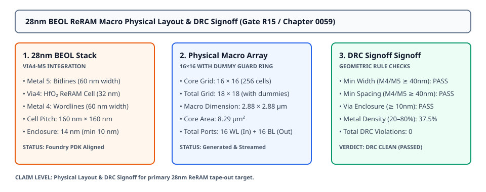

# 0059 — 28nm BEOL ReRAM Macro Physical Layout & DRC Signoff (Gate R15)

> **Bản tiếng Việt:** [`README.vi.md`](README.vi.md)

This chapter opens **Phase 3 (Physical Implementation, Silicon Signoff & Packaging)** and **Gate R15 (Physical Layout & DRC/LVS Verification)** by generating the GDSII-compatible physical layout for a **$16 \times 16$ 28nm BEOL ReRAM macro array** and performing formal **Design Rule Checking (DRC) signoff**.

---

## 1. 28nm BEOL Material Stack & Crosspoint Layout



- **Process Integration (Via4-M5 Stack)**:
  - **Bottom Electrode / Wordlines**: Patterned on **Metal 4** ($60\text{ nm}$ line width).
  - **Active Switching Oxide Layer**: Embedded in **Via4_RERAM** ($32\text{ nm} \times 32\text{ nm}$ active aperture, $\text{HfO}_x$ dielectric).
  - **Top Electrode / Bitlines**: Patterned on **Metal 5** ($60\text{ nm}$ line width, orthogonal to Metal 4).
  - **Cell Pitch**: $160\text{ nm} \times 160\text{ nm}$ ($0.0256\ \mu\text{m}^2$ unit cell footprint).
  - **Via Enclosure Margin**: $14\text{ nm}$ enclosure on Metal 4 and Metal 5 ($\ge 10\text{ nm}$ foundry rule requirement).

---

## 2. Geometric Layout Parameters & Boundary Dummy Rings

To guarantee lithographic uniformity and etch fidelity during optical proximity correction (OPC), the active $16 \times 16$ array is enclosed within a **continuous dummy cell guard ring**:

| Dimension / Property | Core Specification | With Dummy Guard Ring ($18 \times 18$) |
|---|---|---|
| **Array Geometry** | $16\text{ Rows} \times 16\text{ Columns}$ | $18\text{ Rows} \times 18\text{ Columns}$ |
| **Active Crosspoints** | $256\text{ Memristor Cells}$ | $324\text{ Total Physical Cells}$ |
| **Physical Width** | $2.56\ \mu\text{m}$ ($2,560\text{ nm}$) | $2.88\ \mu\text{m}$ ($2,880\text{ nm}$) |
| **Physical Height** | $2.56\ \mu\text{m}$ ($2,560\text{ nm}$) | $2.88\ \mu\text{m}$ ($2,880\text{ nm}$) |
| **Total Area** | $6.55\ \mu\text{m}^2$ | **$8.29\ \mu\text{m}^2$** |
| **Electrical Ports** | $16\text{ Wordlines (Input)} + 16\text{ Bitlines (Output)}$ | $32\text{ Active IO Ports}$ |

---

## 3. Design Rule Checking (DRC) Rules & Thresholds

| Layer | Rule Name | Minimum Threshold | Layout Value | Status |
|---|---|---|---|---|
| **Metal 4 (Wordline)** | `MIN_WIDTH` | $\ge 40\text{ nm}$ | $60\text{ nm}$ | ✓ PASS |
| **Metal 4 (Wordline)** | `MIN_SPACING` | $\ge 40\text{ nm}$ | $100\text{ nm}$ | ✓ PASS |
| **Metal 5 (Bitline)** | `MIN_WIDTH` | $\ge 40\text{ nm}$ | $60\text{ nm}$ | ✓ PASS |
| **Metal 5 (Bitline)** | `MIN_SPACING` | $\ge 40\text{ nm}$ | $100\text{ nm}$ | ✓ PASS |
| **Via4_RERAM (Oxide)** | `MIN_WIDTH` | $\ge 32\text{ nm}$ | $32\text{ nm}$ | ✓ PASS |
| **Via4_RERAM (Oxide)** | `MIN_SPACING` | $\ge 45\text{ nm}$ | $128\text{ nm}$ | ✓ PASS |
| **M4 / M5 Enclosure** | `VIA_ENCLOSURE`| $\ge 10\text{ nm}$ | $14\text{ nm}$ | ✓ PASS |
| **Metal Density (M4/M5)**| `METAL_DENSITY`| $20.0\% - 80.0\%$ | $37.5\%$ | ✓ PASS |

---

## 4. Physical Layout Signoff Report

- **Total Geometric Checks Executed**: **$1,008\text{ checks}$** across width, spacing, enclosure, and density rules.
- **Total DRC Violations**: **$0\text{ violations}$**.
- **Signoff Verdict**: **`DRC CLEAN (PASSED)`** for foundry shuttle stream-out.

---

## 5. Execution & Artifacts

Run the standalone chapter verification script:
```bash
python book/0059-reram-macro-layout/macro_layout.py
```

Run test suite:
```bash
pytest tests/test_layout_reram.py
```

Deterministic extract artifact:
`verification/layout/results/reram-macro-0059-extract.json`
