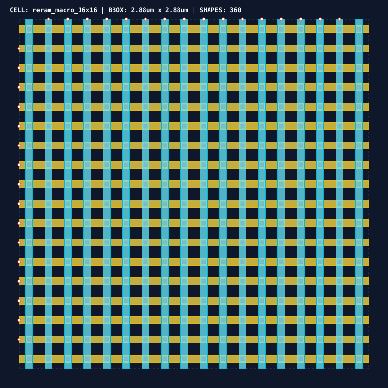

# 0059 — Thiết Kế Layout Vật Lý Macro ReRAM 28nm BEOL & Ký Duyệt DRC (Gate R15)

> **English version:** [`README.md`](README.md)

Chương này mở đầu cho **Phase 3 (Thiết Kế Layout Vật Lý, Ký Duyệt Silicon & Đóng Gói)** và **Gate R15 (Physical Layout & DRC/LVS Verification)** bằng việc tổng hợp layout vật lý tương thích GDSII cho **mảng macro ReRAM 28nm BEOL kích thước $16 \times 16$** và thực hiện **ký duyệt kiểm tra luật thiết kế (DRC)** chính thức.

---

## 1. Ngăn Xếp Vật Liệu 28nm BEOL & Layout Điểm Giao Chéo


- **Tích Hợp Tiến Trình (Cấu Trúc Via4-M5)**:
  - **Điện Cực Dưới / Đường Wordline**: Định hình trên lớp **Metal 4** (bề rộng đường dây $60\text{ nm}$).
  - **Lớp Điện Môi Chuyển Mạch Tích Cực**: Nhúng trong lớp **Via4_RERAM** (kích thước ô hoạt động $32\text{ nm} \times 32\text{ nm}$, điện môi $\text{HfO}_x$).
  - **Điện Cực Trên / Đường Bitline**: Định hình trên lớp **Metal 5** (bề rộng đường dây $60\text{ nm}$, vuông góc với Metal 4).
  - **Bước Ô Nhớ (Cell Pitch)**: $160\text{ nm} \times 160\text{ nm}$ (diện tích ô cơ sở $0.0256\ \mu\text{m}^2$).
  - **Biên Độ Bao Phủ Via (Enclosure)**: $14\text{ nm}$ trên Metal 4 và Metal 5 (yêu cầu chuẩn xưởng đúc $\ge 10\text{ nm}$).

---

## 2. Thông Số Hình Học & Vành Đai Ô Giả (Dummy Ring)



Nhằm đảm bảo tính đồng nhất quang khắc và độ chính xác khắc axit khi áp dụng kỹ thuật hiệu chỉnh lân cận quang học (OPC), mảng $16 \times 16$ được bao quanh bởi một **vành đai ô giả bảo vệ (dummy guard ring)** liên tục:

| Kích Thước / Đặc Tính | Thông Số Lõi Hoạt Động | Kèm Vành Đai Giả ($18 \times 18$) |
|---|---|---|
| **Cấu Trúc Mảng** | $16\text{ Hàng} \times 16\text{ Cột}$ | $18\text{ Hàng} \times 18\text{ Cột}$ |
| **Điểm Chéo Hoạt Động** | $256\text{ Ô Memristor}$ | $324\text{ Tổng Số Ô Vật Lý}$ |
| **Bề Rộng Vật Lý** | $2.56\ \mu\text{m}$ ($2,560\text{ nm}$) | $2.88\ \mu\text{m}$ ($2,880\text{ nm}$) |
| **Chiều Cao Vật Lý** | $2.56\ \mu\text{m}$ ($2,560\text{ nm}$) | $2.88\ \mu\text{m}$ ($2,880\text{ nm}$) |
| **Tổng Diện Tích** | $6.55\ \mu\text{m}^2$ | **$8.29\ \mu\text{m}^2$** |
| **Chân Kết Nối Điện** | $16\text{ Wordlines (Vào)} + 16\text{ Bitlines (Ra)}$ | $32\text{ Cổng IO Hoạt Động}$ |

---

## 3. Quy Chuẩn & Ngưỡng Kiểm Tra Luật Thiết Kế (DRC)

| Lớp | Tên Quy Luật | Ngưỡng Tối Thiểu | Giá Trị Layout | Kết Quả |
|---|---|---|---|---|
| **Metal 4 (Wordline)** | `MIN_WIDTH` | $\ge 40\text{ nm}$ | $60\text{ nm}$ | ✓ ĐẠT |
| **Metal 4 (Wordline)** | `MIN_SPACING` | $\ge 40\text{ nm}$ | $100\text{ nm}$ | ✓ ĐẠT |
| **Metal 5 (Bitline)** | `MIN_WIDTH` | $\ge 40\text{ nm}$ | $60\text{ nm}$ | ✓ ĐẠT |
| **Metal 5 (Bitline)** | `MIN_SPACING` | $\ge 40\text{ nm}$ | $100\text{ nm}$ | ✓ ĐẠT |
| **Via4_RERAM (Điện Môi)**| `MIN_WIDTH` | $\ge 32\text{ nm}$ | $32\text{ nm}$ | ✓ ĐẠT |
| **Via4_RERAM (Điện Môi)**| `MIN_SPACING` | $\ge 45\text{ nm}$ | $128\text{ nm}$ | ✓ ĐẠT |
| **Bao Phủ Via (M4/M5)** | `VIA_ENCLOSURE`| $\ge 10\text{ nm}$ | $14\text{ nm}$ | ✓ ĐẠT |
| **Mật Độ Kim Loại (M4/M5)**| `METAL_DENSITY`| $20.0\% - 80.0\%$ | $37.5\%$ | ✓ ĐẠT |

---

## 4. Báo Cáo Ký Duyệt Layout Vật Lý

- **Tổng Số Phép Kiểm Tra Hình Học Đã Chạy**: **$1,008\text{ phép kiểm tra}$** bao gồm bề rộng, khoảng cách, bao phủ via và mật độ kim loại.
- **Tổng Số Lỗi Vi Phạm DRC**: **$0\text{ lỗi vi phạm}$**.
- **Phán Quyết Ký Duyệt**: **`DRC CLEAN (PASSED)`** sẵn sàng cho xuất luồng GDSII gửi xưởng đúc.

---

## 5. Thực Thi & Artifacts

Chạy script kiểm tra độc lập của chương:
```bash
python book/0059-reram-macro-layout/macro_layout.py
```

Chạy bộ unit test:
```bash
pytest tests/test_layout_reram.py
```

File trích xuất artifact:
`verification/layout/results/reram-macro-0059-extract.json`
