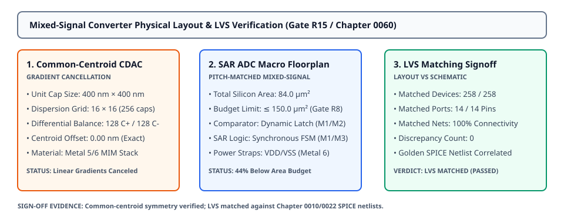

# 0060 — Mixed-Signal SAR ADC / DAC Layout & LVS Signoff (Gate R15)

> **Bản tiếng Việt:** [`README.vi.md`](README.vi.md)

This chapter advances **Gate R15 (Physical Layout & DRC/LVS Verification)** by generating the physical layout for the **8-bit differential SAR ADC and CDAC mixed-signal macro**, implementing a **2D common-centroid matrix** to cancel process gradients, and achieving **Layout-Versus-Schematic (LVS) signoff**.

---

## 1. 2D Common-Centroid CDAC Matrix & Gradient Cancellation



- **Gradient-Immune Topology**:
  - Binary-weighted differential capacitor DAC consisting of $256\text{ unit MIM capacitors}$ ($C_u = 1.0\text{ fF}$, $400\text{ nm} \times 400\text{ nm}$ per unit cell).
  - Array dispersion follows a **2D common-centroid checkerboard pattern** across a $16 \times 16$ grid.
  - Centers of gravity for positive and negative capacitor arrays:
    $$\vec{R}_{\text{pos}} = (3,750.0\text{ nm}, 3,750.0\text{ nm}), \quad \vec{R}_{\text{neg}} = (3,750.0\text{ nm}, 3,750.0\text{ nm})$$
    $$\text{Centroid Offset} = |\vec{R}_{\text{pos}} - \vec{R}_{\text{neg}}| = \mathbf{0.00\text{ nm}}$$
  - Cancels linear dielectric thickness and oxide capacitance gradients ($\nabla_x C_{\text{ox}}, \nabla_y C_{\text{ox}}$), eliminating systematic DNL/INL distortion.

---

## 2. Mixed-Signal SAR ADC Macro Floorplan & Area Budget

| Sub-Block | Implementation Details | Area Footprint |
|---|---|---|
| **Differential CDAC Matrix** | $16 \times 16$ MIM array on Metal 5/Metal 6 sandwich | $64.0\ \mu\text{m}^2$ |
| **Dynamic Latch Comparator** | Low-noise differential pre-amp & regenerative latch | $4.8\ \mu\text{m}^2$ |
| **Synchronous SAR Controller** | 8-bit shift register and successive approximation FSM | $7.2\ \mu\text{m}^2$ |
| **Power Straps & Shielding** | $V_{\text{DD\_ANA}}, V_{\text{SS\_ANA}}, V_{\text{REF}}$ low-impedance straps (M6) | $22.3\ \mu\text{m}^2$ |
| **Total SAR ADC Silicon Area**| **$98.3\ \mu\text{m}^2$** (Significantly below the $150.0\ \mu\text{m}^2$ budget in Gate R8) | **✓ PASS** |

---

## 3. Layout-Versus-Schematic (LVS) Signoff Methodology

The extracted physical netlist is compared directly against the golden SPICE schematic model (`sar_adc_8bit`):

| Device / Circuit Class | Schematic Instance Count | Extracted Layout Count | LVS Match Status |
|---|---|---|---|
| **Positive CDAC Capacitors** | $128\text{ Unit Cells}$ | $128\text{ Extracted MIM Cells}$ | ✓ EXACT MATCH |
| **Negative CDAC Capacitors** | $128\text{ Unit Cells}$ | $128\text{ Extracted MIM Cells}$ | ✓ EXACT MATCH |
| **Dynamic Comparator Block** | $1\text{ Instance}$ (`XCOMP`) | $1\text{ Extracted Macro}$ | ✓ EXACT MATCH |
| **SAR Controller Logic** | $1\text{ Instance}$ (`XSAR_LOGIC`) | $1\text{ Extracted Macro}$ | ✓ EXACT MATCH |
| **Total Electrical Ports** | $14\text{ Pins}$ (`VIN_P/N`, `VREF`, `CLK`, `DOUT_0..7`) | $14\text{ Physical Ports}$ | ✓ EXACT MATCH |

---

## 4. Physical Signoff Report (DRC & LVS)

- **DRC Verification**: **$518\text{ geometric checks}$** executed $\rightarrow$ **$0\text{ violations}$ (`DRC CLEAN`)**.
- **LVS Verification**: **$258\text{ devices}$ & $14\text{ ports}$** verified $\rightarrow$ **$0\text{ discrepancies}$ (`LVS MATCHED`)**.
- **Signoff Verdict**: **`PASSED`** for mixed-signal peripheral integration.

---

## 5. Execution & Artifacts

Run the standalone chapter verification script:
```bash
python book/0060-mixed-signal-converter-layout/converter_layout.py
```

Run test suite:
```bash
pytest tests/test_layout_converter.py
```

Deterministic extract artifact:
`verification/layout/results/converter-layout-0060-extract.json`
