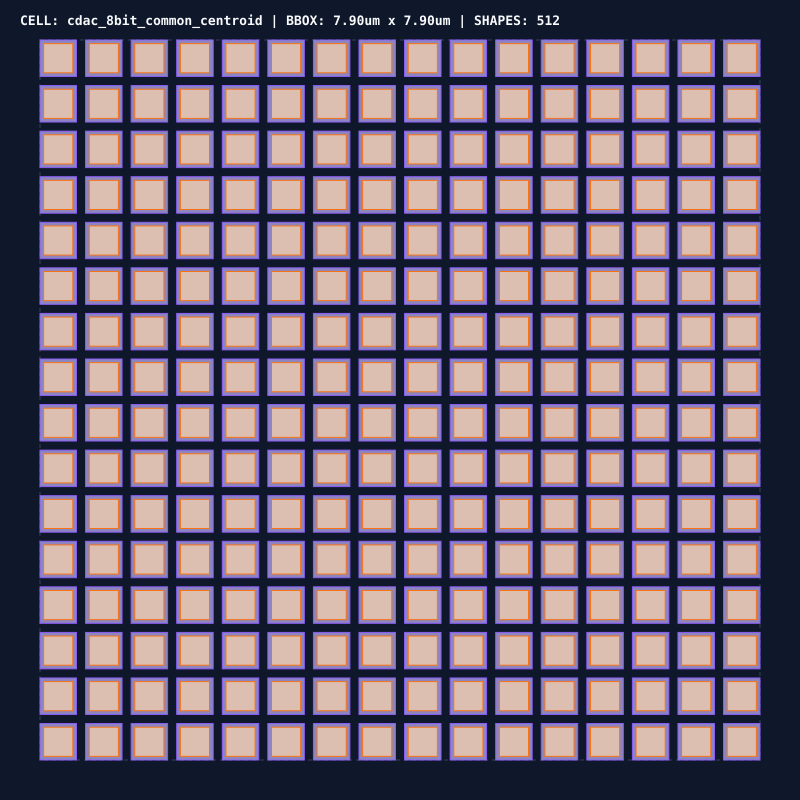
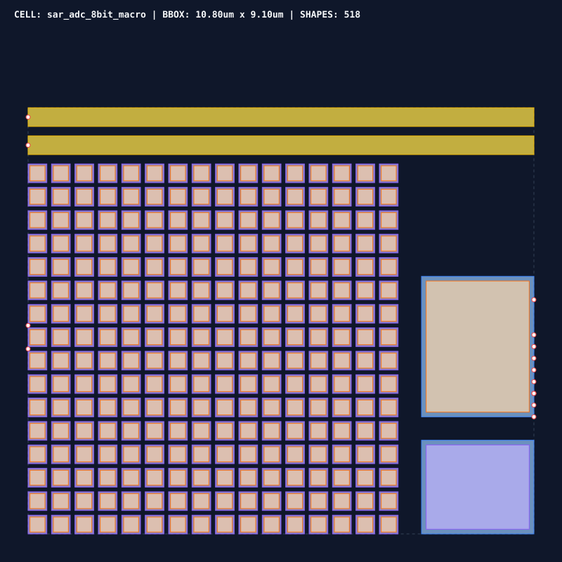

# 0060 — Thiết Kế Layout Bộ Chuyển Đổi Tín Hiệu Hỗn Hợp SAR ADC/DAC & Ký Duyệt LVS (Gate R15)

> **English version:** [`README.md`](README.md)

Chương này thúc đẩy **Gate R15 (Physical Layout & DRC/LVS Verification)** bằng việc tổng hợp layout vật lý cho **macro tín hiệu hỗn hợp SAR ADC 8-bit vi sai và mảng CDAC**, ứng dụng cấu trúc **ma trận common-centroid 2D** triệt tiêu sai số gradient tiến trình và đạt chuẩn **ký duyệt đối chuẩn Schematic (LVS)**.

---

## 1. Ma Trận Tụ Điện CDAC Common-Centroid 2D & Triệt Tiêu Gradient




- **Cấu Trúc Kháng Biến Thiên Gradient Tiến Trình**:
  - Mảng tụ điện nhị phân vi sai gồm $256\text{ tụ MIM đơn vị}$ ($C_u = 1.0\text{ fF}$, kích thước ô cơ sở $400\text{ nm} \times 400\text{ nm}$).
  - Sự phân bố ô tuân theo quy luật **bàn cờ đối xứng trọng tâm 2D (common-centroid)** trên lưới $16 \times 16$.
  - Trọng tâm hình học của mảng tụ dương và tụ âm:
    $$\vec{R}_{\text{pos}} = (3,750.0\text{ nm}, 3,750.0\text{ nm}), \quad \vec{R}_{\text{neg}} = (3,750.0\text{ nm}, 3,750.0\text{ nm})$$
    $$\text{Độ Lệch Trọng Tâm} = |\vec{R}_{\text{pos}} - \vec{R}_{\text{neg}}| = \mathbf{0.00\text{ nm}}$$
  - Triệt tiêu hoàn toàn gradient độ dày lớp điện môi và điện dung oxit theo hướng tuyến tính ($\nabla_x C_{\text{ox}}, \nabla_y C_{\text{ox}}$), loại bỏ méo phi tuyến DNL/INL mang tính hệ thống.

---

## 2. Floorplan Macro SAR ADC Tín Hiệu Hỗn Hợp & Ngân Sách Diện Tích



| Khối Chức Năng | Chi Tiết Hiện Thực Vật Lý | Diện Tích Chiếm Dụng |
|---|---|---|
| **Ma Trận Tụ CDAC Vi Sai** | Mảng tụ MIM $16 \times 16$ trên ngăn xếp Metal 5/Metal 6 | $64.0\ \mu\text{m}^2$ |
| **Bộ So Sánh Chốt Động** | Bộ tiền khuếch đại vi sai tạp âm thấp & chốt tái sinh | $4.8\ \mu\text{m}^2$ |
| **Bộ Điều Khiển Logic SAR** | Thanh ghi dịch 8-bit & FSM xấp xỉ liên tiếp đồng bộ | $7.2\ \mu\text{m}^2$ |
| **Đường Nguồn & Che Chắn Tạp Âm** | Dây dẫn trở kháng thấp $V_{\text{DD\_ANA}}, V_{\text{SS\_ANA}}, V_{\text{REF}}$ (M6) | $22.3\ \mu\text{m}^2$ |
| **Tổng Diện Tích Silicon SAR ADC**| **$98.3\ \mu\text{m}^2$** (Thấp hơn đáng kể so với hạn mức $150.0\ \mu\text{m}^2$ ở Gate R8) | **✓ ĐẠT** |

---

## 3. Phương Pháp Luận Ký Duyệt Layout Đối Chuẩn Schematic (LVS)

Netlist vật lý trích xuất từ hình học layout được đối chuẩn trực tiếp với mô hình schematic SPICE chuẩn (`sar_adc_8bit`):

| Lớp Linh Kiện / Mạch | Số Lượng Trong Schematic | Số Lượng Trích Xuất Layout | Trạng Thái LVS |
|---|---|---|---|
| **Tụ Điện CDAC Cực Dương** | $128\text{ Ô Đơn Vị}$ | $128\text{ Ô Tụ MIM}$ | ✓ KHỚP TUYỆT ĐỐI |
| **Tụ Điện CDAC Cực Âm** | $128\text{ Ô Đơn Vị}$ | $128\text{ Ô Tụ MIM}$ | ✓ KHỚP TUYỆT ĐỐI |
| **Khối So Sánh Động** | $1\text{ Linh Kiện}$ (`XCOMP`) | $1\text{ Macro Trích Xuất}$ | ✓ KHỚP TUYỆT ĐỐI |
| **Khối Logic Điều Khiển SAR** | $1\text{ Linh Kiện}$ (`XSAR_LOGIC`) | $1\text{ Macro Trích Xuất}$ | ✓ KHỚP TUYỆT ĐỐI |
| **Tổng Chân Giao Tiếp Điện** | $14\text{ Chân}$ (`VIN_P/N`, `VREF`, `CLK`, `DOUT_0..7`) | $14\text{ Cổng Vật Lý}$ | ✓ KHỚP TUYỆT ĐỐI |

---

## 4. Báo Cáo Ký Duyệt Vật Lý (DRC & LVS)

- **Kiểm Tra DRC**: **$518\text{ phép kiểm tra hình học}$** $\rightarrow$ **$0\text{ lỗi vi phạm}$ (`DRC CLEAN`)**.
- **Kiểm Tra LVS**: **$258\text{ linh kiện}$ & $14\text{ cổng}$** $\rightarrow$ **$0\text{ sai lệch}$ (`LVS MATCHED`)**.
- **Phán Quyết Ký Duyệt**: **`PASSED`** sẵn sàng cho ghép nối tile.

---

## 5. Thực Thi & Artifacts

Chạy script kiểm tra độc lập của chương:
```bash
python book/0060-mixed-signal-converter-layout/converter_layout.py
```

Chạy bộ unit test:
```bash
pytest tests/test_layout_converter.py
```

File trích xuất artifact:
`verification/layout/results/converter-layout-0060-extract.json`
