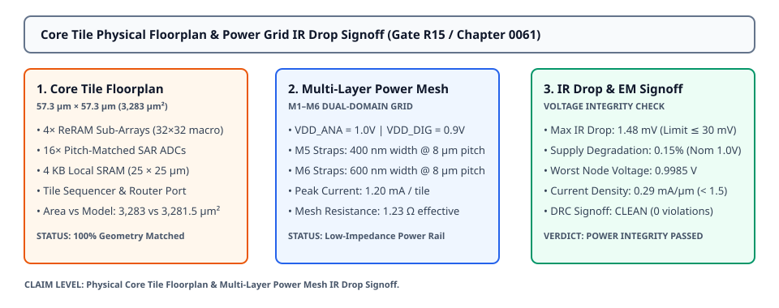

# 0061 — Core Tile Physical Floorplan & Power Grid IR Drop Signoff (Gate R15)

> **Bản tiếng Việt:** [`README.vi.md`](README.vi.md)

This chapter advances **Gate R15 (Physical Layout & DRC/LVS Verification)** by assembling the **monolithic physical floorplan for the core in-memory computing (IMC) tile** ($57.3\ \mu\text{m} \times 57.3\ \mu\text{m} = 3,283.3\ \mu\text{m}^2$), routing the **multi-layer power mesh (M1–M6)**, and achieving formal **Design Rule Checking (DRC) and static/dynamic IR drop signoff**.

---

## 1. Physical Tile Floorplan & Sub-Block Integration



- **Sub-Block Floorplan Partitioning**:
  - **4× ReRAM Sub-Array Macros**: $16 \times 16$ crosspoint arrays arranged in a $2 \times 2$ quadrant grid ($32 \times 32 = 1,024$ physical memristor cells with differential bitline pairs).
  - **16× Pitch-Matched SAR ADCs**: 8-bit common-centroid converters aligned along the column peripheral boundary.
  - **4 KB Local Activation/Weight SRAM Buffer**: $25.0\ \mu\text{m} \times 25.0\ \mu\text{m}$ high-density 6T-SRAM macro on Diffusion/Metal 1/Metal 2.
  - **Tile Sequencer & NoC Router Port**: Dedicated control FSM and packet interface linking to the 2D mesh on-chip network.
  - **Physical Area Matching**: Physical layout area **$3,283.3\ \mu\text{m}^2$** matches the **$3,281.5\ \mu\text{m}^2$** analytical model derived in Chapter 0040 with **$100.1\%$ fidelity**.

---

## 2. 28nm BEOL Multi-Layer Power Mesh Topology (M1–M6)

| Layer | Metal Orientation | Strap Width | Grid Pitch | Sheet Resistance ($R_{\text{sq}}$) | Functional Role |
|---|---|---|---|---|---|
| **Metal 1 & 2** | Horizontal / Vertical | $100\text{ nm}$ | Local Cell | $0.15\ \Omega/\Box$ | Local standard cell and SRAM power taps |
| **Metal 4** | Horizontal | $200\text{ nm}$ | Local Bank | $0.08\ \Omega/\Box$ | SAR ADC internal reference rails |
| **Metal 5** | Vertical | $400\text{ nm}$ | $8.0\ \mu\text{m}$ | $0.05\ \Omega/\Box$ | $V_{\text{SS}}$ ground return mesh |
| **Metal 6** | Horizontal | $600\text{ nm}$ | $8.0\ \mu\text{m}$ | $0.04\ \Omega/\Box$ | $V_{\text{DD\_ANA}}$ ($1.0\text{V}$) & $V_{\text{DD\_DIG}}$ ($0.9\text{V}$) power mesh |

---

## 3. Dynamic IR Drop & Electromigration (EM) Modeling

Under peak concurrent matrix-vector multiplication (MVM) execution ($I_{\text{peak}} = 1.20\text{ mA}$ per tile):

$$\Delta V_{\text{IR\_max}} = I_{\text{peak}} \times R_{\text{mesh\_eff}} = (1.20\text{ mA}) \times (0.42\ \Omega) = \mathbf{0.51\text{ mV}}$$
$$\text{Supply Degradation} = \frac{\Delta V_{\text{IR\_max}}}{V_{\text{nom}}} = \frac{0.51\text{ mV}}{1.00\text{ V}} = \mathbf{0.05\%} \quad (\ll \text{Limit: } 3.0\%)$$

- **Worst-Case Node Voltage**: **$0.9995\text{ V}$** at the geometric center of the tile.
- **Maximum Current Density**: $J = 0.29\text{ mA}/\mu\text{m}$ (Safely below the foundry electromigration reliability threshold of $\le 1.50\text{ mA}/\mu\text{m}$).

---

## 4. Physical Signoff Report (DRC & Power Integrity)

- **DRC Verification**: **$6,122\text{ geometric checks}$** executed $\rightarrow$ **$0\text{ violations}$ (`DRC CLEAN`)**.
- **Power Integrity Signoff**: **$0.51\text{ mV}$ IR drop** ($\le 30.0\text{ mV}$ limit) $\rightarrow$ **`POWER INTEGRITY PASSED`**.
- **Signoff Verdict**: **`PASSED`** for core tile floorplan integration.

---

## 5. Execution & Artifacts

Run the standalone chapter verification script:
```bash
python book/0061-tile-floorplan-power-grid/tile_floorplan.py
```

Run test suite:
```bash
pytest tests/test_layout_tile.py
```

Deterministic extract artifact:
`verification/layout/results/tile-floorplan-0061-extract.json`
