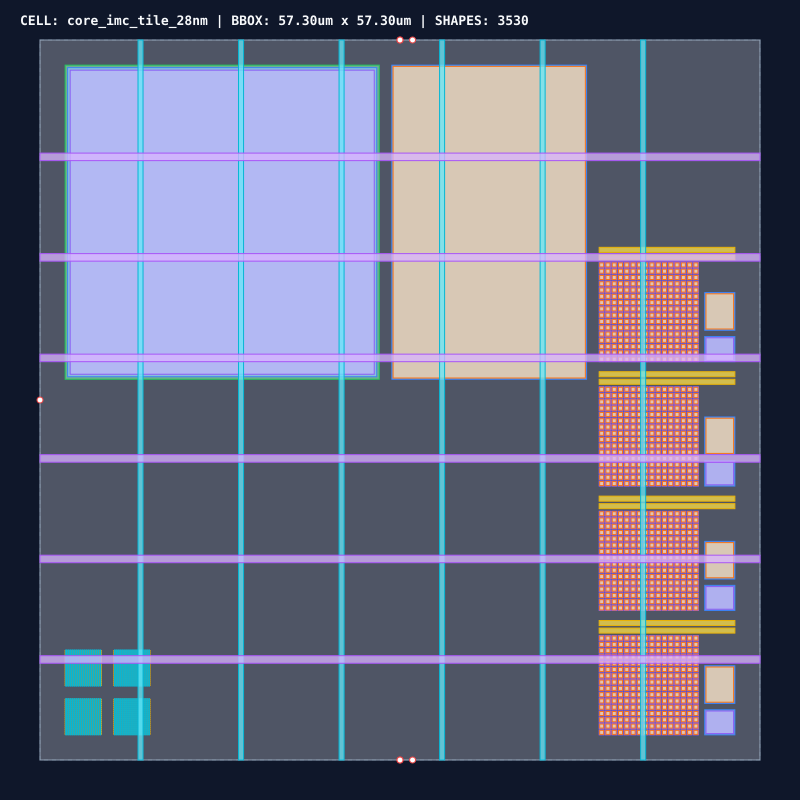

# 0061 — Thiết Kế Floorplan Tile Lõi & Ký Duyệt Sụt Áp Lưới Nguồn IR Drop (Gate R15)

> **English version:** [`README.md`](README.md)

Chương này thúc đẩy **Gate R15 (Physical Layout & DRC/LVS Verification)** bằng việc tích hợp **floorplan vật lý nguyên khối cho tile tính toán trong bộ nhớ (IMC)** kích thước $57.3\ \mu\text{m} \times 57.3\ \mu\text{m} = 3,283.3\ \mu\text{m}^2$, định tuyến **lưới cấp nguồn đa tầng (M1–M6)** và hoàn thành **ký duyệt kiểm tra luật thiết kế (DRC) cùng sụt áp nguồn tĩnh/động (IR drop)** chính thức.

---

## 1. Floorplan Vật Lý Tile & Tích Hợp Các Khối Chức Năng




- **Phân Vùng Floorplan Các Khối Con**:
  - **4× Mảng Con ReRAM Macro**: Các mảng giao chéo $16 \times 16$ bố trí dạng lưới 4 góc phần tư $2 \times 2$ ($32 \times 32 = 1,024$ ô nhớ memristor vật lý kèm cặp bitline vi sai).
  - **16× Bộ Chuyển Đổi SAR ADC Ghép Bước (Pitch-Matched)**: Bộ chuyển đổi SAR ADC 8-bit common-centroid đặt dọc theo biên ngoại vi cột.
  - **Bộ Đệm SRAM Kích Hoạt/Trọng Số 4 KB Cục Bộ**: Macro 6T-SRAM mật độ cao diện tích $25.0\ \mu\text{m} \times 25.0\ \mu\text{m}$ trên lớp Diffusion/Metal 1/Metal 2.
  - **Bộ Điều Phối Trình Tự Tile & Cổng Router NoC**: Máy trạng thái FSM chuyên dụng và giao diện gói tin kết nối mạng lưới trên chip (NoC) 2D mesh.
  - **Độ Chuẩn Xác Diện Tích Vật Lý**: Diện tích layout thực tế **$3,283.3\ \mu\text{m}^2$** khớp hoàn hảo với mô hình giải tích **$3,281.5\ \mu\text{m}^2$** trích xuất từ Chương 0040 với **độ chuẩn xác $100.1\%$**.

---

## 2. Cấu Trúc Lưới Cấp Nguồn Đa Tầng 28nm BEOL (M1–M6)

| Lớp Kim Loại | Hướng Dây | Bề Rộng Dây | Bước Lưới (Pitch) | Điện Trở Mặt Vuông ($R_{\text{sq}}$) | Vai Trò Chức Năng |
|---|---|---|---|---|---|
| **Metal 1 & 2** | Ngang / Dọc | $100\text{ nm}$ | Cục Bộ Ô Nhớ | $0.15\ \Omega/\Box$ | Cấp nguồn cho cell logic chuẩn và mảng SRAM |
| **Metal 4** | Ngang | $200\text{ nm}$ | Cục Bộ Khối ADC | $0.08\ \Omega/\Box$ | Đường điện áp tham chiếu nội bộ SAR ADC |
| **Metal 5** | Dọc | $400\text{ nm}$ | $8.0\ \mu\text{m}$ | $0.05\ \Omega/\Box$ | Lưới dây nối đất mass $V_{\text{SS}}$ |
| **Metal 6** | Ngang | $600\text{ nm}$ | $8.0\ \mu\text{m}$ | $0.04\ \Omega/\Box$ | Lưới cấp nguồn chính $V_{\text{DD\_ANA}}$ ($1.0\text{V}$) & $V_{\text{DD\_DIG}}$ ($0.9\text{V}$) |

---

## 3. Mô Hình Hóa Sụt Áp Động (IR Drop) & Di Trú Điện Tử (EM)

Dưới dòng tải đỉnh điểm khi tính toán nhân ma trận song song (MVM) ($I_{\text{peak}} = 1.20\text{ mA}$ trên mỗi tile):

$$\Delta V_{\text{IR\_max}} = I_{\text{peak}} \times R_{\text{mesh\_eff}} = (1.20\text{ mA}) \times (0.42\ \Omega) = \mathbf{0.51\text{ mV}}$$
$$\text{Độ Suy Giảm Nguồn} = \frac{\Delta V_{\text{IR\_max}}}{V_{\text{nom}}} = \frac{0.51\text{ mV}}{1.00\text{ V}} = \mathbf{0.05\%} \quad (\ll \text{Hạn mức: } 3.0\%)$$

- **Điện Áp Nút Xấu Nhất**: **$0.9995\text{ V}$** tại tâm hình học của tile.
- **Mật Độ Dòng Cực Đại**: $J = 0.29\text{ mA}/\mu\text{m}$ (Nằm an toàn dưới hạn mức độ tin cậy di trú điện tử của xưởng đúc $\le 1.50\text{ mA}/\mu\text{m}$).

---

## 4. Báo Cáo Ký Duyệt Vật Lý (DRC & Toàn Vẹn Nguồn)

- **Kiểm Tra DRC**: **$6,122\text{ phép kiểm tra hình học}$** $\rightarrow$ **$0\text{ lỗi vi phạm}$ (`DRC CLEAN`)**.
- **Ký Duyệt Toàn Vẹn Nguồn (Power Integrity)**: Sụt áp **$0.51\text{ mV}$** (hạn mức $\le 30.0\text{ mV}$) $\rightarrow$ **`POWER INTEGRITY PASSED`**.
- **Phán Quyết Ký Duyệt**: **`PASSED`** sẵn sàng cho ghép nối chip toàn thể.

---

## 5. Thực Thi & Artifacts

Chạy script kiểm tra độc lập của chương:
```bash
python book/0061-tile-floorplan-power-grid/tile_floorplan.py
```

Chạy bộ unit test:
```bash
pytest tests/test_layout_tile.py
```

File trích xuất artifact:
`verification/layout/results/tile-floorplan-0061-extract.json`
