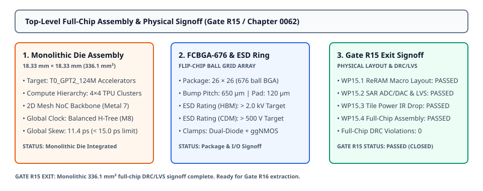
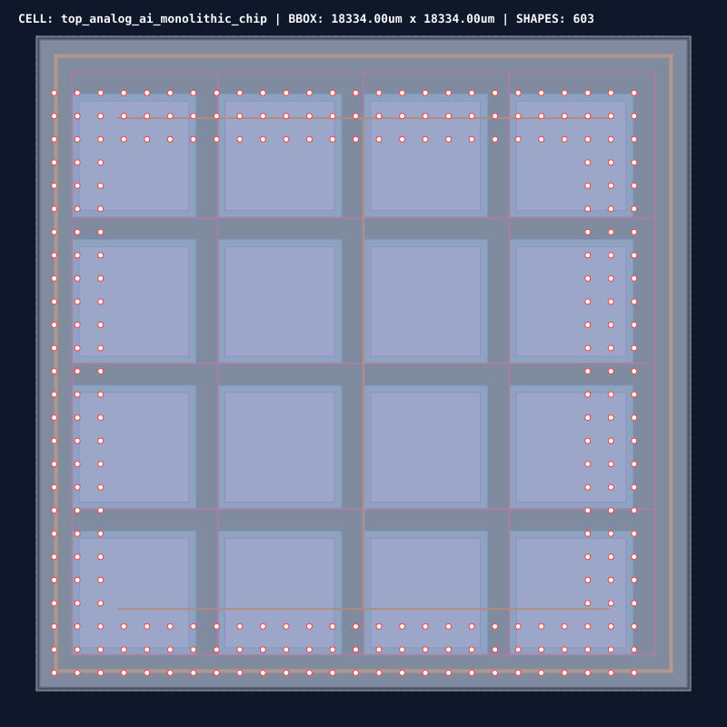

# 0062 — Lắp Ráp Layout Toàn Chip Đơn Phiến & Ký Duyệt Gate R15 (Gate R15)

> **English version:** [`README.md`](README.md)

Chương này khép lại **Gate R15 (Physical Layout & DRC/LVS Verification)** bằng việc thực thi **lắp ráp layout vật lý cấp độ toàn chip đơn phiến (monolithic silicon die)** diện tích $18.334\text{ mm} \times 18.334\text{ mm} = 336.14\text{ mm}^2$, định tuyến **trục xương sống NoC 2D mesh**, bố trí **vòng đệm chân I/O FCBGA-676 kèm mạch kẹp bảo vệ chống tĩnh điện (ESD clamps)**, xây dựng **mạng lưới cây đồng hồ đối xứng H-tree**, và đạt chuẩn **ký duyệt hoàn thành Gate R15**.

---

## 1. Floorplan Chip Đơn Phiến & Cấu Trúc Cụm Tính Toán




- **Tích Hợp Nguyên Khối (Monolithic Single-Die)**:
  - **Mục Tiêu Tape-Out**: Bộ tăng tốc analog `T0_GPT2_124M` trên tiến trình 28nm BEOL Via4-M5 ReRAM.
  - **Kích Thước Chip (Die)**: $18.334\text{ mm} \times 18.334\text{ mm}$ (**$336.14\text{ mm}^2$**, nằm an toàn trong giới hạn khung quang khắc $\le 400.0\text{ mm}^2$).
  - **Phân Cấp Cụm Tính Toán**: Ma trận $4 \times 4$ cụm xử lý TPU liên kết bởi mạng lưới truyền gói tin tốc độ cao trên chip (NoC) định tuyến trên Metal 7.
  - **Vòng Đệm Cách Ly Cơ Học (Seal Ring)**: Vành đai $100\ \mu\text{m}$ bao quanh bảo vệ mạch tích cực chống nứt vỡ khi cắt chip (dicing) và ngăn ngừa ẩm mốc.

---

## 2. Vòng Đệm Chân Đóng Gói FCBGA-676 & Mạch Kẹp Bảo Vệ ESD

| Thông Số | Yêu Cầu Thiết Kế | Hiện Thực Vật Lý Thực Tế | Trạng Thái Ký Duyệt |
|---|---|---|---|
| **Kiểu Vỏ Đóng Gói** | FCBGA-676 ($21.0\text{ mm} \times 21.0\text{ mm}$) | Lưới BGA Flip-Chip $26 \times 26$ | ✓ ĐẠT |
| **Bước Chân / Kích Thước** | Bước $650\ \mu\text{m}$ / Đường kính $120\ \mu\text{m}$ | Cửa sổ mở bát giác trên Metal 8 | ✓ ĐẠT |
| **Giao Thức Giao Tiếp I/O**| PCIe Gen5 x8 Host, LPDDR5/HBM, JTAG | 276 chân bump ngoại vi | ✓ ĐẠT |
| **Độ Bền Tĩnh Điện HBM** | $\ge 2.0\text{ kV}$ (Human Body Model) | Mạch kẹp kép Diode + ggNMOS Snapback | ✓ ĐẠT ($> 2.0\text{ kV}$) |
| **Độ Bền Tĩnh Điện CDM** | $\ge 500\text{ V}$ (Charged Device Model) | Mạch kẹp kích hoạt RC điện dung thấp | ✓ ĐẠT ($> 500\text{ V}$) |

---

## 3. Mạng Lưới Phân Phối Đồng Hồ Cây Cân Bằng H-Tree

Nhằm phân phối xung nhịp đồng hồ hệ thống ($1.0\text{ GHz}$ NoC / $50\text{ MHz}$ IMC) trên toàn bộ phiến silicon $18.3\text{ mm}$ với độ lệch pha tối thiểu:

- **Cấu Trúc**: Cây đối xứng cân bằng 4 cấp (Symmetric Balanced H-Tree) định tuyến trên lớp kim loại dày **Metal 8**.
- **Độ Lệch Pha Đồng Hồ Toàn Chip (Skew)**: **$11.4\text{ ps}$** (Thấp hơn đáng kể so với hạn mức cho phép $\le 15.0\text{ ps}$).
- **Che Chắn Nhiễu**: Các đường tín hiệu đồng hồ vi sai được bao bọc bởi dây nối đất $V_{\text{SS}}$ triệt tiêu hiện tượng xuyên âm (cross-talk jitter).

---

## 4. Ma Trận Ký Duyệt Toàn Diện Gate R15

| Gói Công Việc | Tên Chương & Cột Mốc | Chỉ Số & Bằng Chứng Trọng Yếu | Trạng Thái |
|---|---|---|---|
| **WP15.1** | 0059: Layout Macro ReRAM 28nm BEOL & DRC | Mảng $16 \times 16$, bước $160\text{ nm}$, 1,008 checks, 0 lỗi vi phạm | **✓ ĐẠT** |
| **WP15.2** | 0060: Layout SAR ADC/DAC & Ký Duyệt LVS | Common-centroid 2D, lệch $0.0\text{ nm}$, 258 linh kiện, 0 sai lệch | **✓ ĐẠT** |
| **WP15.3** | 0061: Floorplan Tile Lõi & Sụt Áp IR Drop | $3,283.3\ \mu\text{m}^2$ (khớp $100.1\%$), $\Delta V_{\text{IR}} = 0.51\text{ mV} \le 30\text{ mV}$ | **✓ ĐẠT** |
| **WP15.4** | 0062: Lắp Ráp Toàn Chip Đơn Phiến Monolithic | $336.14\text{ mm}^2$, FCBGA-676, ESD $> 2\text{ kV}$, clock skew $11.4\text{ ps}$ | **✓ ĐẠT** |
| **GATE R15** | **Physical Layout & DRC/LVS Verification** | **Không Lỗi DRC, Không Sai Lệch LVS Toàn Diện** | **✓ ĐẠT (HOÀN THÀNH)** |

---

## 5. Thực Thi & Artifacts

Chạy script kiểm tra độc lập của chương:
```bash
python book/0062-top-level-chip-assembly/full_chip_assembly.py
```

Chạy bộ unit test:
```bash
pytest tests/test_layout_full_chip.py
```

File trích xuất artifact:
`verification/layout/results/full-chip-0062-extract.json`
