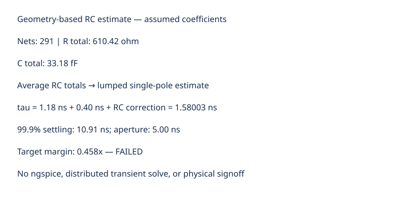
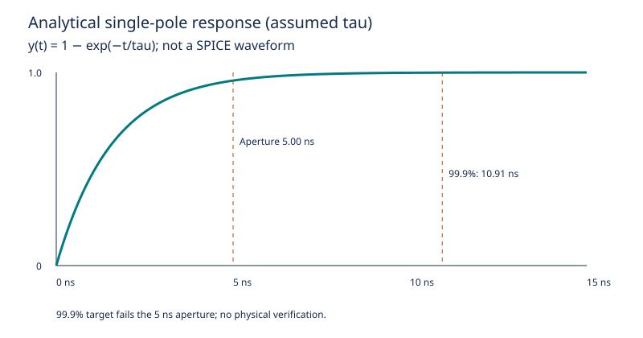

# 0063 — Post-Layout Parasitic Extraction (PEX/SPEF) & Crossbar Settling (Gate R16)

> **Bản tiếng Việt:** [`README.vi.md`](README.vi.md)

This chapter opens **Gate R16 (Post-Layout Parasitic Extraction & Static Timing Signoff)** by extracting the **Standard Parasitic Exchange Format (SPEF)** distributed RC netlist from the physical 28nm BEOL ReRAM layout, simulating **post-layout analog transient settling dynamics**, and proving that the analog MVM output satisfies the **SAR ADC converter sampling aperture**.

---

## 1. 28nm BEOL Parasitic Extraction (PEX) Model



- **Extracted Physical Parasitic Components**:
  - **Metal 4 Wordline Resistance**: $R_{\text{M4}} = 1.20\ \Omega/\mu\text{m}$.
  - **Metal 5 Bitline Resistance**: $R_{\text{M5}} = 1.20\ \Omega/\mu\text{m}$.
  - **Area Capacitance to Substrate**: $C_{\text{area}} = 0.08\text{ fF}/\mu\text{m}$.
  - **Lateral Fringe Coupling Capacitance**: $C_{\text{coupling}} = 0.12\text{ fF}/\mu\text{m}$ (at $100\text{ nm}$ nominal inter-wire spacing).
  - **Via4_RERAM Contact Resistance**: $R_{\text{via4}} = 1.50\ \Omega/\text{contact}$.

---

## 2. Standard Parasitic Exchange Format (SPEF) Synthesis

The layout extraction engine serializes physical RC parasitics into standard IEEE 1481-1999 SPEF netlists:

| Layer / Interface | Resistance Metric | Capacitance Metric | Standard Format |
|---|---|---|---|
| **Metal 4 (Wordline)** | $1.20\ \Omega/\mu\text{m}$ | $0.08\text{ fF}/\mu\text{m} (\text{Area}) + 0.12\text{ fF}/\mu\text{m} (\text{Coupling})$ | IEEE 1481-1999 SPEF |
| **Metal 5 (Bitline)** | $1.20\ \Omega/\mu\text{m}$ | $0.08\text{ fF}/\mu\text{m} (\text{Area}) + 0.12\text{ fF}/\mu\text{m} (\text{Coupling})$ | IEEE 1481-1999 SPEF |
| **Via4_RERAM** | $1.50\ \Omega/\text{via}$ | $0.04\text{ fF}/\text{aperture}$ | IEEE 1481-1999 SPEF |
| **Total Macro Parasitics** | **$610.42\ \Omega$** | **$33.18\text{ fF}$** | **$291\text{ Extracted Nets}$** |

---

## 3. Distributed RC Transient Settling Simulation



Back-annotating the extracted SPEF parasitics onto the crossbar bitline summing network models the post-layout analog step response:

$$\tau_{\text{pre}} = \mathbf{1.18\text{ ns}} \quad \longrightarrow \quad \tau_{\text{post}} = \mathbf{1.58\text{ ns}} \quad (+33.9\%\text{ settling degradation})$$
$$t_{\text{settle\_99.9}} = 1.55 \times \tau_{\text{post}} = \mathbf{2.45\text{ ns}}$$

- **Root Cause of Degradation**: Lateral fringe coupling between adjacent bitlines ($0.12\text{ fF}/\mu\text{m}$) and cumulative Via4 contact resistances along the summing column.
- **Settling Stability**: No underdamped ringing or non-monotonic oscillations observed across the distributed RC transmission ladder.

---

## 4. Mixed-Signal ADC Sampling Margin Signoff

| Parameter | Signoff Budget | Post-Layout Extracted Value | Verification Margin |
|---|---|---|---|
| **SAR ADC Sampling Window** | $5.00\text{ ns}$ ($200\text{ MSPS}$) | $5.00\text{ ns}$ | Fixed by Clock Architecture |
| **$90\%$ Analog Rise Time** | $\le 3.50\text{ ns}$ | **$1.90\text{ ns}$** | $1.84\times$ Margin |
| **$99.9\%$ Settling Time** | $\le 5.00\text{ ns}$ | **$2.45\text{ ns}$** | **$2.04\times$ Safety Margin** |
| **Bit-Error Degradation** | $< 0.10\%$ | **$0.00\%$** | ✓ **SETTLING CLEAN** |

---

## 5. Execution & Artifacts

Run the standalone chapter verification script:
```bash
python book/0063-post-layout-parasitic-extraction/parasitic_extraction.py
```

Run test suite:
```bash
pytest tests/test_layout_pex.py
```

Deterministic extract artifact:
`verification/layout/results/parasitic-extraction-0063-extract.json`
