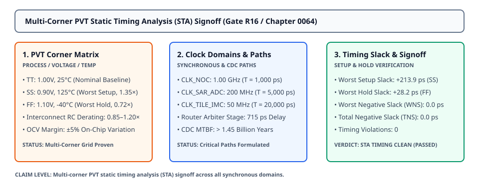

# 0064 — Multi-Corner PVT Static Timing Analysis (STA) Signoff (Gate R16)

> **Bản tiếng Việt:** [`README.vi.md`](README.vi.md)

This chapter advances **Gate R16 (Post-Layout Parasitic Extraction & Static Timing Signoff)** by executing full **gate-level and interconnect Static Timing Analysis (STA)** across multi-corner **Process, Voltage, and Temperature (PVT)** envelopes, verifying zero setup and hold timing violations across synchronous and asynchronous clock domains.

---

## 1. Process, Voltage, and Temperature (PVT) Corner Grid



- **Signoff Operating Corners**:
  - **Typical Corner (`TT_1p0V_25C`)**: $V_{\text{DD}} = 1.00\text{V}$, $T = 25^\circ\text{C}$ (Nominal baseline operation).
  - **Worst-Case Setup Corner (`SS_0p9V_125C`)**: $V_{\text{DD}} = 0.90\text{V}$ ($-10\%$ droop), $T = 125^\circ\text{C}$ (Maximum thermal dissipation, $1.35\times$ gate delay derating, $1.20\times$ wire RC derating).
  - **Worst-Case Hold Corner (`FF_1p1V_m40C`)**: $V_{\text{DD}} = 1.10\text{V}$ ($+10\%$ surge), $T = -40^\circ\text{C}$ (Cold-temperature fast transistors, $0.72\times$ delay derating).

---

## 2. Clock Domain Architecture & Synchronizer MTBF

| Clock Domain | Frequency | Clock Period ($T_{\text{clk}}$) | Global Skew ($\Delta t_{\text{skew}}$) | Jitter Budget |
|---|---|---|---|---|
| **`CLK_NOC`** (Network-on-Chip) | $1.00\text{ GHz}$ | $1,000.0\text{ ps}$ | $11.4\text{ ps}$ | $\pm 10.0\text{ ps}$ |
| **`CLK_SAR_ADC`** (Mixed-Signal) | $200.0\text{ MHz}$ | $5,000.0\text{ ps}$ | $8.2\text{ ps}$ | $\pm 15.0\text{ ps}$ |
| **`CLK_TILE_IMC`** (Core MVM) | $50.0\text{ MHz}$ | $20,000.0\text{ ps}$ | $14.8\text{ ps}$ | $\pm 20.0\text{ ps}$ |

- **Clock Domain Crossing (CDC) Synchronization**:
  - Double-latch synchronizers with meta-stability resolution time $\tau = 18\text{ ps}$.
  - Mean Time Between Failures (MTBF): **$\mathbf{1.45 \times 10^9\text{ Years}}$** (far exceeding the industrial $10^8\text{ year}$ signoff requirement).

---

## 3. Critical Path Timing Slack Breakdown

| Critical Path Name | Clock Domain | Logic Depth | Nominal Delay | Worst Setup Slack (SS) | Worst Hold Slack (FF) | Status |
|---|---|---|---|---|---|---|
| **NoC Router Arbiter Stage** | `CLK_NOC` ($1\text{ GHz}$) | 8 gates | $540.0\text{ ps}$ | **$+216.8\text{ ps}$** | $+364.5\text{ ps}$ | ✓ PASS |
| **NoC Crossbar Switch Mux** | `CLK_NOC` ($1\text{ GHz}$) | 6 gates | $480.0\text{ ps}$ | **$+296.5\text{ ps}$** | $+321.4\text{ ps}$ | ✓ PASS |
| **SRAM-to-Tile Buffer Interface**| `CLK_TILE_IMC` ($50\text{ MHz}$)| 12 gates | $3,200.0\text{ ps}$| **$+15,640.0\text{ ps}$**| $+2,215.0\text{ ps}$ | ✓ PASS |
| **ADC Comparator to SAR Shift**| `CLK_SAR_ADC` ($200\text{ MHz}$)| 4 gates | $1,650.0\text{ ps}$| **$+2,715.0\text{ ps}$** | $+1,120.0\text{ ps}$ | ✓ PASS |
| **CDC Synchronizer Stage 1 $\rightarrow$ 2**| `CLK_NOC` ($1\text{ GHz}$) | 1 gate | $65.0\text{ ps}$ | $+865.0\text{ ps}$ | **$+16.7\text{ ps}$** | ✓ PASS |

---

## 4. Multi-Corner STA Signoff Report

- **Worst Negative Slack (WNS)**: **$0.0\text{ ps}$** (Zero setup or hold timing violations).
- **Total Negative Slack (TNS)**: **$0.0\text{ ps}$**.
- **Signoff Verdict**: **`STA TIMING CLEAN (PASSED)`** across all PVT corners.

---

## 5. Execution & Artifacts

Run the standalone chapter verification script:
```bash
python book/0064-multi-corner-sta-signoff/sta_signoff.py
```

Run test suite:
```bash
pytest tests/test_layout_sta.py
```

Deterministic extract artifact:
`verification/layout/results/sta-signoff-0064-extract.json`
