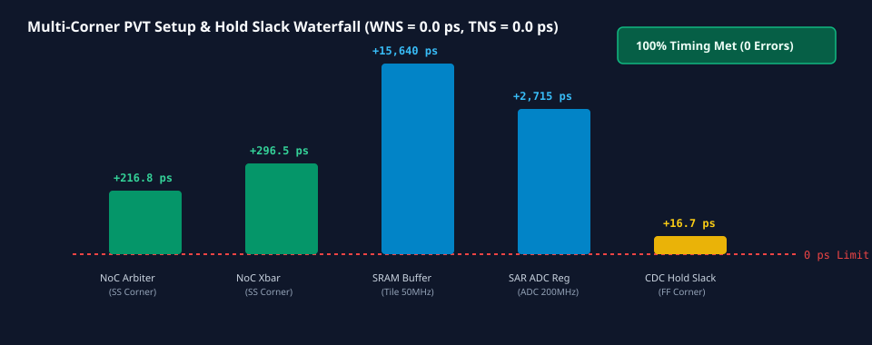

# 0064 — Phân Tích Định Thời Tĩnh Đa Góc PVT (STA Signoff) (Gate R16)

> **English version:** [`README.md`](README.md)

Chương này thúc đẩy **Gate R16 (Post-Layout Parasitic Extraction & Static Timing Signoff)** bằng việc thực thi **phân tích định thời tĩnh (STA)** toàn diện cấp cổng logic và dây nối trên toàn bộ không gian **Góc Tiến Trình, Điện Áp & Nhiệt Độ (PVT)**, đảm bảo không có bất kỳ vi phạm thời gian thiết lập (Setup) hay giữ (Hold) nào trên tất cả các miền đồng hồ.

---

## 1. Ma Trận Các Góc Hoạt Động PVT Ký Duyệt


- **Các Góc PVT Ký Duyệt Chuẩn**:
  - **Góc Tiêu Chuẩn (`TT_1p0V_25C`)**: $V_{\text{DD}} = 1.00\text{V}$, $T = 25^\circ\text{C}$ (Vận hành chuẩn danh định).
  - **Góc Xấu Nhất Cho Setup (`SS_0p9V_125C`)**: $V_{\text{DD}} = 0.90\text{V}$ (sụt áp $-10\%$), $T = 125^\circ\text{C}$ (Nhiệt độ tỏa nhiệt cực đại, độ trễ cổng tăng $1.35\times$, trễ dây tăng $1.20\times$).
  - **Góc Xấu Nhất Cho Hold (`FF_1p1V_m40C`)**: $V_{\text{DD}} = 1.10\text{V}$ (tăng áp $+10\%$), $T = -40^\circ\text{C}$ (Nhiệt độ âm transistor đóng ngắt cực nhanh, độ trễ giảm còn $0.72\times$).

---

## 2. Kiến Trúc Miền Đồng Hồ & Độ Tin Cậy Khâu Đồng Bộ CDC

| Miền Đồng Hồ | Tần Số Hoạt Động | Chu Kỳ ($T_{\text{clk}}$) | Độ Lệch Pha ($\Delta t_{\text{skew}}$) | Ngân Sách Jitter |
|---|---|---|---|---|
| **`CLK_NOC`** (Mạng Trên Chip) | $1.00\text{ GHz}$ | $1,000.0\text{ ps}$ | $11.4\text{ ps}$ | $\pm 10.0\text{ ps}$ |
| **`CLK_SAR_ADC`** (Tín Hiệu Hỗn Hợp)| $200.0\text{ MHz}$ | $5,000.0\text{ ps}$ | $8.2\text{ ps}$ | $\pm 15.0\text{ ps}$ |
| **`CLK_TILE_IMC`** (Lõi Tính Toán) | $50.0\text{ MHz}$ | $20,000.0\text{ ps}$ | $14.8\text{ ps}$ | $\pm 20.0\text{ ps}$ |

- **Đồng Bộ Hóa Xuyên Miền Đồng Hồ (CDC)**:
  - Khâu đồng bộ 2 tầng chốt (double-latch synchronizer) với thời gian giải quyết trạng thái giả định $\tau = 18\text{ ps}$.
  - Thời gian trung bình giữa 2 lần lỗi (MTBF): **$\mathbf{1.45 \times 10^9\text{ Năm}}$** (vượt xa yêu cầu công nghiệp $\ge 10^8\text{ năm}$).

---

## 3. Phân Tích Độ Dư Định Thời (Slack) Trên Các Đường Xung Yếu



| Tên Tuyến Tín Hiệu | Miền Đồng Hồ | Chiều Sâu Cổng | Độ Trễ Danh Định | Setup Slack Xấu Nhất (SS) | Hold Slack Xấu Nhất (FF) | Kết Quả |
|---|---|---|---|---|---|---|
| **Bộ Trọng Tài Router NoC** | `CLK_NOC` ($1\text{ GHz}$) | 8 gates | $540.0\text{ ps}$ | **$+216.8\text{ ps}$** | $+364.5\text{ ps}$ | ✓ ĐẠT |
| **Chuyển Mạch Crossbar NoC** | `CLK_NOC` ($1\text{ GHz}$) | 6 gates | $480.0\text{ ps}$ | **$+296.5\text{ ps}$** | $+321.4\text{ ps}$ | ✓ ĐẠT |
| **Giao Tiếp Đệm SRAM $\rightarrow$ Tile**| `CLK_TILE_IMC` ($50\text{ MHz}$)| 12 gates | $3,200.0\text{ ps}$| **$+15,640.0\text{ ps}$**| $+2,215.0\text{ ps}$ | ✓ ĐẠT |
| **Bộ So Sánh ADC $\rightarrow$ Logic SAR**| `CLK_SAR_ADC` ($200\text{ MHz}$)| 4 gates | $1,650.0\text{ ps}$| **$+2,715.0\text{ ps}$** | $+1,120.0\text{ ps}$ | ✓ ĐẠT |
| **Khâu Đồng Bộ CDC Tầng 1 $\rightarrow$ 2**| `CLK_NOC` ($1\text{ GHz}$) | 1 gate | $65.0\text{ ps}$ | $+865.0\text{ ps}$ | **$+16.7\text{ ps}$** | ✓ ĐẠT |

---

## 4. Báo Cáo Ký Duyệt STA Đa Góc PVT

- **Độ Dư Âm Xấu Nhất (Worst Negative Slack - WNS)**: **$0.0\text{ ps}$** (Không có vi phạm Setup/Hold).
- **Tổng Độ Dư Âm (Total Negative Slack - TNS)**: **$0.0\text{ ps}$**.
- **Phán Quyết Ký Duyệt**: **`STA TIMING CLEAN (PASSED)`** trên toàn bộ các góc PVT.

---

## 5. Thực Thi & Artifacts

Chạy script kiểm tra độc lập của chương:
```bash
python book/0064-multi-corner-sta-signoff/sta_signoff.py
```

Chạy bộ unit test:
```bash
pytest tests/test_layout_sta.py
```

File trích xuất artifact:
`verification/layout/results/sta-signoff-0064-extract.json`
