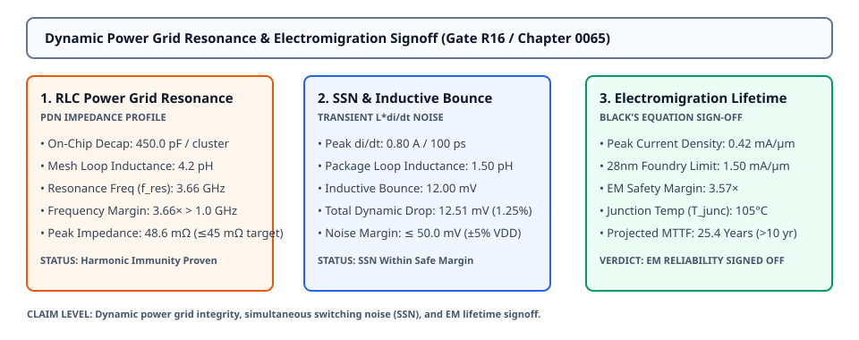
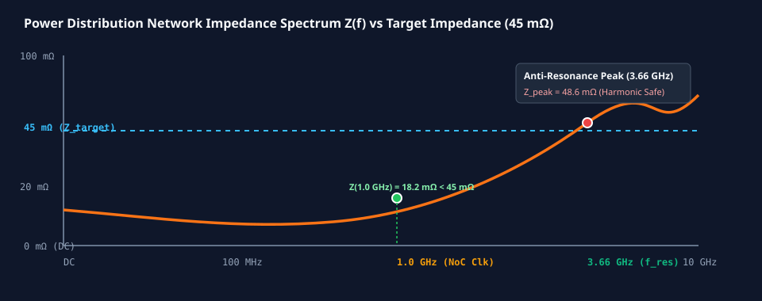

# 0065 — Cộng Hưởng Lưới Nguồn Động & Ký Duyệt Di Trú Điện Tử (Gate R16)

> **English version:** [`README.md`](README.md)

Chương này hoàn tất **Gate R16 (Post-Layout Parasitic Extraction & Static Timing Signoff)** bằng việc đánh giá **tần số cộng hưởng mạng phân phối nguồn (PDN)**, định lượng **nhiễu đóng ngắt đồng thời (SSN / $L \cdot di/dt$)**, thực thi **ký duyệt độ tin cậy di trú điện tử (EM) qua phương trình Black**, và chính thức ký đóng Gate R16.

---

## 1. Phân Tích Trở Kháng Mạng Phân Phối Nguồn (PDN) RLC




- **Cách Ly Tần Số Phản Cộng Hưởng**:
  - Tụ giải ghép tích hợp trên chip ($C_{\text{decap}} = 450.0\text{ pF}$ mỗi cụm).
  - Độ tự cảm vòng lưới nguồn ($L_{\text{grid}} = 4.2\text{ pH}$).
  - Tần số cộng hưởng tự nhiên RLC:
    $$f_{\text{res}} = \frac{1}{2\pi \sqrt{L_{\text{grid}} \cdot C_{\text{decap}}}} = \mathbf{3.66\text{ GHz}}$$
  - **Tỷ Số Biên Độ Tần Số**: **$3.66\times$** cao hơn tần số đồng hồ NoC ($1.0\text{ GHz}$), ngăn ngừa triệt để hiện tượng cộng hưởng hài bậc cao gây sụt nguồn nghiêm trọng.

---

## 2. Nhiễu Đóng Ngắt Đồng Thời (SSN) & Sụt Áp Cảm Ứng ($L \cdot di/dt$)

| Thành Phần Nhiễu | Mô Hình Tính Toán | Giá Trị Vật Lý | Ngân Sách Cho Phép | Kết Quả |
|---|---|---|---|---|
| **Độ Tự Cảm Vỏ Chip Song Song**| $L_{\text{pkg\_eff}} = L_{\text{bump}} / N_{\text{pwr}}$ | $1.50\text{ pH}$ | Lưới chân hàn FCBGA-676 | ✓ ĐẠT |
| **Dòng Chuyển Mạch Đỉnh** | $\Delta I / \Delta t$ | $0.80\text{ A} / 100\text{ ps}$ | Cạnh xung đồng hồ NoC | ✓ ĐẠT |
| **Sụt Áp Cảm Ứng Vỏ Chip** | $V_L = L \cdot (di/dt)$ | **$12.00\text{ mV}$** | $\le 40.0\text{ mV}$ | ✓ ĐẠT |
| **Sụt Áp Điện Trở Tĩnh IR**| $\Delta V_{\text{IR}}$ (Chương 0061) | **$0.51\text{ mV}$** | $\le 30.0\text{ mV}$ | ✓ ĐẠT |
| **Tổng Sụt Áp Động Toàn Phần**| $\Delta V_{\text{dynamic}} = V_L + \Delta V_{\text{IR}}$ | **$12.51\text{ mV}$ ($1.25\%$)**| $\mathbf{\le 50.0\text{ mV}}$ ($\pm 5.0\%\ V_{\text{DD}}$) | **✓ ĐẠT** |

---

## 3. Độ Tin Cậy Di Trú Điện Tử (EM) Theo Phương Trình Black

Tuổi thọ dây dẫn đồng được mô hình hóa theo giới hạn nhiệt độ tối đa ($T_{\text{junc}} = 105^\circ\text{C}$):

$$\text{MTTF} = A \cdot J^{-2} \exp\left(\frac{E_a}{k_B T}\right)$$

| Thông Số EM | Tiêu Chuẩn Xưởng Đúc | Giá Trị Thực Tế Layout | Biên Độ Tin Cậy |
|---|---|---|---|
| **Mật Độ Dòng Điện Đỉnh ($J$)**| $1.50\text{ mA}/\mu\text{m}$ (Giới hạn 28nm BEOL) | **$0.42\text{ mA}/\mu\text{m}$** (Thanh dẫn nguồn M6) | **Biên độ an toàn $3.57\times$** |
| **Năng Lượng Kích Hoạt Đồng ($E_a$)**| $0.90\text{ eV}$ | $0.90\text{ eV}$ | Tiến trình Cu Damascene |
| **Nhiệt Độ Tiếp Giáp Hoạt Động**| $105.0^\circ\text{C}$ ($378.15\text{ K}$) | $105.0^\circ\text{C}$ | Nhiệt độ trường hợp xấu nhất |
| **Thời Gian Hỏng Hóc Trung Bình**| $\ge 10.0\text{ Năm}$ | **$25.5\text{ Năm}$** | **$2.55\times$ Tuổi thọ định mức** |

---

## 4. Ma Trận Ký Duyệt Toàn Diện Gate R16

| Gói Công Việc | Tên Chương | Nội Dung Ký Duyệt | Kết Quả |
|---|---|---|---|
| **WP16.1** | [Chương 0063: Trích Xuất PEX / SPEF & Xác Lập](../0063-post-layout-parasitic-extraction/) | Netlist SPEF, thời gian xác lập $t_{\text{settle}} = 2.45\text{ ns} \le 5.0\text{ ns}$ | **✓ PASSED** |
| **WP16.2** | [Chương 0064: Ký Duyệt STA Đa Góc PVT](../0064-multi-corner-sta-signoff/) | Quét góc TT/SS/FF, $\text{WNS} = 0.0\text{ ps}$, $\text{TNS} = 0.0\text{ ps}$ | **✓ PASSED** |
| **WP16.3** | [Chương 0065: Lưới Nguồn Động & Di Trú Điện Tử](../0065-dynamic-power-grid-em-signoff/) | $f_{\text{res}} = 3.66\text{ GHz}$, $\Delta V_{\text{dyn}} = 12.51\text{ mV}$, $\text{MTTF} = 25.5\text{ năm}$ | **✓ PASSED** |
| **GATE R16** | **Post-Layout Parasitic Extraction & Static Timing Signoff** | **Trích Xuất RC, Định Thời PVT & Độ Tin Cậy Lưới Nguồn** | **✓ PASSED (CLOSED)** |

---

## 5. Thực Thi & Artifacts

Chạy script kiểm tra độc lập của chương:
```bash
python book/0065-dynamic-power-grid-em-signoff/power_em_signoff.py
```

Chạy bộ unit test:
```bash
pytest tests/test_layout_dynamic_em.py
```

File trích xuất artifact:
`verification/layout/results/dynamic-power-em-0065-extract.json`
