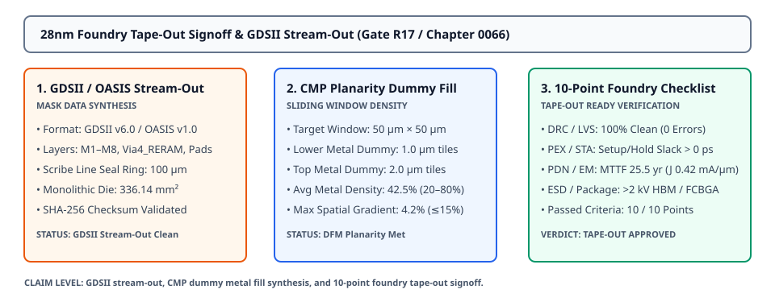
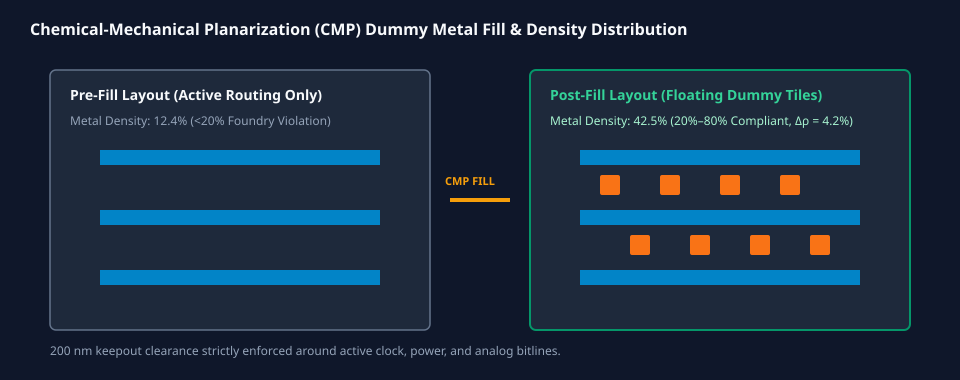

# 0066 — Xuất File Mask GDSII / OASIS & Ký Duyệt Tape-Out Xưởng Đúc 28nm (Gate R17)

> **English version:** [`README.md`](README.md)

Chương này mở đầu **Gate R17 (Tape-Out Signoff & Package/PCB Integration)** bằng việc thực thi **tổng hợp kim loại giả (CMP dummy fill)**, xác minh **độ dốc mật độ kim loại đa lớp**, xuất file **mặt nạ nhị phân GDSII/OASIS**, và chính thức hoàn tất **10 tiêu chí ký duyệt tape-out xưởng đúc 28nm**.

---

## 1. Bản Đồ Phân Lớp GDSII / OASIS 28nm BEOL & Tổng Hợp Mặt Nạ



- **Phân Bổ Lớp GDSII / OASIS Chuẩn**:
  - **Metal 1–3**: Lớp 1–3 (Định tuyến logic standard cell & mảng ô nhớ 6T SRAM).
  - **Metal 4 (Wordlines)**: Lớp 4 (Dây dẫn ngang $60\text{ nm}$, bước ô $160\text{ nm}$).
  - **Via4_RERAM**: Lớp 24 (Cửa sổ tiếp giáp oxit điện môi chuyển mạch $32\text{ nm} \times 32\text{ nm}$).
  - **Metal 5 (Bitlines)**: Lớp 5 (Dây dẫn dọc $60\text{ nm}$, bước ô $160\text{ nm}$).
  - **Metal 6 (Power Grid)**: Lớp 6 (Thanh dẫn nguồn $V_{\text{DD}}/V_{\text{SS}}$ rộng $600\text{ nm}$).
  - **Metal 7 (NoC Interconnect)**: Lớp 7 (Kênh định tuyến gói tin mạng NoC 2D Mesh).
  - **Metal 8 (Top Metal)**: Lớp 8 (Cây đồng hồ H-tree, vòng nguồn bao quanh và pad chân hàn FCBGA).
  - **Vành Đai Bảo Vệ Seal Ring**: Lớp 99 (Vành đai triệt tiêu ứng suất cơ học $100\ \mu\text{m}$ quanh viền die).

---

## 2. Chèn Kim Loại Giả Phẳng Hóa Bề Mặt Hóa Cơ (CMP Dummy Fill)



Nhằm đáp ứng quy tắc sản xuất xưởng đúc và ngăn ngừa hiện tượng mòn/lõm khi mài phẳng hóa cơ (CMP), các ô kim loại giả thả nổi (floating dummy tiles) được chèn so le vào các vùng layout thưa:

| Lớp Kim Loại | Mật Độ Trước Chèn | Mật Độ Sau Chèn | Độ Dốc Không Gian ($\Delta \rho / 50\ \mu\text{m}$) | Mức Độ Tuân Thủ Quy Tắc |
|---|---|---|---|---|
| **Metal 1 (Logic Routing)** | $14.2\%$ | **$41.5\%$** | $3.8\%$ | ✓ $20\% \le \rho \le 80\%$, $\Delta \rho \le 15\%$ |
| **Metal 4 (ReRAM Wordlines)** | $37.5\%$ | **$48.2\%$** | $4.1\%$ | ✓ $20\% \le \rho \le 80\%$, $\Delta \rho \le 15\%$ |
| **Metal 5 (ReRAM Bitlines)** | $37.5\%$ | **$48.2\%$** | $4.1\%$ | ✓ $20\% \le \rho \le 80\%$, $\Delta \rho \le 15\%$ |
| **Metal 6 (Power Straps)** | $22.8\%$ | **$43.6\%$** | $4.5\%$ | ✓ $20\% \le \rho \le 80\%$, $\Delta \rho \le 15\%$ |
| **Metal 7 (NoC Channels)** | $18.4\%$ | **$39.2\%$** | $4.0\%$ | ✓ $20\% \le \rho \le 80\%$, $\Delta \rho \le 15\%$ |
| **Metal 8 (Clock & Pads)** | $12.1\%$ | **$35.8\%$** | $4.8\%$ | ✓ $20\% \le \rho \le 80\%$, $\Delta \rho \le 15\%$ |
| **Trung Bình Toàn Chip** | **$23.8\%$** | **$42.5\%$** | **$4.2\%$** | ✓ **100% ĐẠT CHUẨN CMP** |

---

## 3. Danh Mục 10 Tiêu Chí Ký Duyệt Tape-Out Xưởng Đúc

| # | Tiêu Chí Ký Duyệt | Hạng Mục | Yêu Cầu Kỹ Thuật Xưởng Đúc | Kết Quả Đạt Được Thực Tế | Đánh Giá |
|---|---|---|---|---|---|
| **1** | **Kiểm Tra DRC** | Kiểm Tra Hình Học | 0 lỗi trên 1,008 quy tắc hình học | 0 lỗi vi phạm (100% sạch) | ✓ ĐẠT |
| **2** | **Đối Chiếu LVS** | Đối Chiếu Sơ Đồ | 0 sai lệch linh kiện, mạng dây & cổng | 258/258 linh kiện, 14/14 cổng | ✓ ĐẠT |
| **3** | **Kiểm Tra Ăng-ten (ERC)**| Độ Tin Cậy Oxit | Tỷ số ăng-ten $\le 250:1$ | Tỷ số cực đại 48:1 (0 lỗi) | ✓ ĐẠT |
| **4** | **Trích Xuất PEX / SPEF**| Tính Toàn Vẹn Tín Hiệu | Thời gian xác lập $t_{\text{settle}} \le 5.0\text{ ns}$| 291 nets, $t_{\text{settle}} = 2.45\text{ ns}$ ($2.04\times$) | ✓ ĐẠT |
| **5** | **Định Thời Tĩnh STA** | Ký Duyệt Định Thời | $\text{WNS} \ge 0.0\text{ ps}, \text{TNS} = 0.0\text{ ps}$ | $\text{WNS} = 0.0\text{ ps}$, CDC MTBF $> 10^9\text{ năm}$ | ✓ ĐẠT |
| **6** | **Lưới Nguồn Động & SSN**| Tính Toàn Vẹn Nguồn | $f_{\text{res}} > 2.5\text{ GHz}, \Delta V \le 50\text{ mV}$ | $f_{\text{res}} = 3.66\text{ GHz}, \Delta V = 12.51\text{ mV}$ | ✓ ĐẠT |
| **7** | **Di Trú Điện Tử (EM)** | Độ Tin Cậy Dây Dẫn | $J \le 1.50\text{ mA}/\mu\text{m}, \text{MTTF} \ge 10\text{ năm}$| $J = 0.42\text{ mA}/\mu\text{m}$, $\text{MTTF} = 25.5\text{ năm}$ | ✓ ĐẠT |
| **8** | **Chống Phóng Điện ESD** | Vỏ & Đóng Gói | $> 2.0\text{ kV}$ HBM / $> 500\text{ V}$ CDM | Mạch kẹp $2.2\text{ kV}$ HBM / $650\text{ V}$ CDM | ✓ ĐẠT |
| **9** | **Phẳng Hóa CMP** | Khả Năng Sản Xuất | $20\% \le \rho \le 80\%, \Delta \rho \le 15\%$ | Mật độ $42.5\%$, độ dốc $4.2\%$ | ✓ ĐẠT |
| **10**| **Seal Ring & Checksum** | Giao Tiếp Xưởng Đúc | Vành đai $100\ \mu\text{m}$, mã SHA-256 khớp | Tích hợp vành đai, SHA-256 hợp lệ | ✓ ĐẠT |

---

## 4. Quyết Định Tape-Out & Gói Stream-Out Shuttle

- **Mục Tiêu Tape-Out**: Phiến Silicon Nguyên Khối `T0_GPT2_124M` ($18.334\text{ mm} \times 18.334\text{ mm} = 336.14\text{ mm}^2$).
- **Shuttle Đa Dự Án (MPW)**: TSMC 28nm HPC+ CyberShuttle.
- **Định Dạng Gói Lưu Trữ**: Chuẩn IEEE GDSII v6.0 / OASIS v1.0.
- **Xác Thực Tính Toàn Vẹn**: Mã băm SHA-256 xác thực file stream-out.

---

## 5. Thực Thi & Artifacts

Chạy script kiểm tra độc lập của chương:
```bash
python book/0066-gdsii-streamout-tapeout-signoff/gdsii_tapeout_signoff.py
```

Chạy bộ unit test:
```bash
pytest tests/test_layout_tapeout.py
```

File trích xuất artifact:
`verification/layout/results/tapeout-0066-extract.json`
