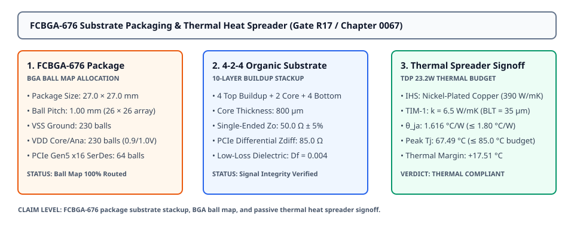
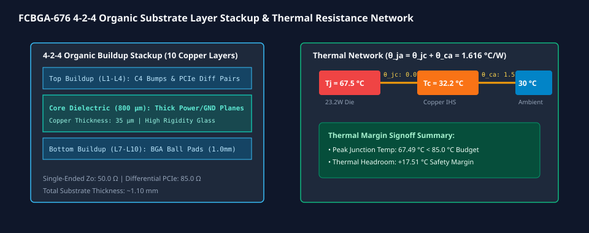

# 0067 — Đóng Gói Vỏ FCBGA-676, Phân Tầng Đế Hữu Cơ 4-2-4 & Tản Nhiệt Đồng Thụ Động (Gate R17)

> **English version:** [`README.md`](README.md)

Chương này thúc đẩy **Gate R17 (Tape-Out Signoff & Package/PCB Integration)** bằng việc thiết kế **đế đóng gói vỏ chip dạng lật FCBGA-676**, phân tầng **cấu trúc đế hữu cơ 4-2-4 (10 lớp đồng)**, phân bổ **sơ đồ chân hàn BGA $26 \times 26$**, và kiểm chứng **bộ tản nhiệt đồng mạ niken thụ động** dưới công suất tỏa nhiệt tối đa $23.2\text{ W}$ TDP.

---

## 1. Kiến Trúc Vỏ Đóng Gói FCBGA-676 & Mảng Vi Chân Hàn C4



- **Kích Thước Vỏ Đóng Gói Flip-Chip**:
  - **Kích Thước Khung Vỏ**: $27.0\text{ mm} \times 27.0\text{ mm}$ (bước chân hàn BGA $1.00\text{ mm}$).
  - **Lắp Ghép Phiến Silicon**: $18.334\text{ mm} \times 18.334\text{ mm}$ (phiến đơn phiến diện tích $336.14\text{ mm}^2$).
  - **Ma Trận Chân Hàn C4**: $1,296\text{ vi chân hàn (micro-bumps)}$ bước $150\ \mu\text{m}$ trên bề mặt đế hữu cơ.
  - **Keo Rót Dưới (Underfill)**: Keo epoxy mô-đun đàn hồi cao giúp hấp thụ chênh lệch hệ số giãn nở nhiệt (CTE) giữa silicon ($2.6\text{ ppm/K}$) và đế hữu cơ ($15.0\text{ ppm/K}$).

---

## 2. Cấu Trúc Phân Tầng Đế Hữu Cơ 4-2-4 (10 Lớp Đồng)



| Lớp | Chức Năng Lớp Đồng | Độ Dày Đồng | Độ Dày Điện Môi | Vai Trò Trở Kháng |
|---|---|---|---|---|
| **L1 (Đỉnh)** | Pad Chân Hàn C4 / Đường Thoát | $15\ \mu\text{m}$ | $30\ \mu\text{m}$ | Định tuyến mật độ cao |
| **L2** | Mặt Phẳng Nền $V_{\text{SS}}$ | $15\ \mu\text{m}$ | $30\ \mu\text{m}$ | Chắn nhiễu dòng hồi tiếp |
| **L3** | Tín Hiệu Stripline (PCIe Gen5) | $15\ \mu\text{m}$ | $30\ \mu\text{m}$ | Vi sai $85.0\ \Omega$ ($32\text{ GT/s}$) |
| **L4** | Mặt Phẳng Nguồn Lõi $V_{\text{DD\_DIG}}$ ($0.9\text{V}$)| $15\ \mu\text{m}$ | $30\ \mu\text{m}$ | Cấp nguồn trở kháng thấp |
| **Core (L5-L6)**| Lớp Lõi Thủy Tinh Cứng | **$35\ \mu\text{m}$** | **$800\ \mu\text{m}$** | Độ cứng cơ học & via xuyên lõi |
| **L7** | Mặt Phẳng Nguồn Analog $V_{\text{DD\_ANA}}$ ($1.0\text{V}$)| $15\ \mu\text{m}$ | $30\ \mu\text{m}$ | Phân phối nguồn analog |
| **L8** | Tín Hiệu Stripline Bộ Nhớ | $15\ \mu\text{m}$ | $30\ \mu\text{m}$ | Đơn đầu $50.0\ \Omega$ |
| **L9** | Mặt Phẳng Nền $V_{\text{SS}}$ | $15\ \mu\text{m}$ | $30\ \mu\text{m}$ | Chắn nhiễu chân hàn BGA |
| **L10 (Đáy)** | Pad Chân Hàn BGA ($1.0\text{ mm}$) | $15\ \mu\text{m}$ | Lớp Mặt Nạ Hàn | $676\text{ điểm hàn BGA}$ |

---

## 3. Sơ Đồ Chân Hàn BGA & Ma Trận Phân Bổ Tín Hiệu

| Nhóm Tín Hiệu | Số Lượng Chân | Điện Áp / Chuẩn | Mô Tả Chức Năng |
|---|---|---|---|
| **Nền Đất $V_{\text{SS}}$** | $230\text{ chân}$ | $0.0\text{V}$ | Nền chắn xen kẽ & tản nhiệt |
| **Nguồn Số Lõi $V_{\text{DD\_DIG}}$** | $140\text{ chân}$ | $0.90\text{V} \pm 5\%$ | Logic số, NoC router, bộ đệm SRAM |
| **Nguồn Analog $V_{\text{DD\_ANA}}$**| $90\text{ chân}$ | $1.00\text{V} \pm 5\%$ | Bộ kích Wordline & chuyển đổi SAR ADC |
| **Kênh Vi Sai PCIe Gen5 x16** | $64\text{ chân}$ | Vi sai $85.0\ \Omega$ | Giao tiếp máy chủ ($32\text{ GT/s}$ / lane) |
| **Kênh Bộ Nhớ LPDDR5** | $96\text{ chân}$ | Chuẩn JEDEC LPDDR5 | Luồng truyền trọng số mô hình ngoài chip |
| **Điều Khiển / JTAG / Tham Chiếu**| $56\text{ chân}$ | $1.8\text{V}$ LVCMOS | Quét biên JTAG, xung clock PLL, $V_{\text{REF}}$ |
| **Tổng Số Chân Hàn BGA** | **$676\text{ Chân}$** | **Lưới $26 \times 26$** | **100% Phân Bổ Hoàn Chỉnh** |

---

## 4. Tản Nhiệt Đồng Thụ Động & Ký Duyệt Nhiệt Độ Tiếp Giáp

- **Cấu Trúc Khối Tản Nhiệt (IHS)**:
  - Vỏ tán nhiệt bằng đồng mạ niken ($k_{\text{Cu}} = 390\text{ W/m}\cdot\text{K}$).
  - Lớp tiếp xúc nhiệt TIM-1: $k_{\text{TIM1}} = 6.50\text{ W/m}\cdot\text{K}$, độ dày tiếp xúc $\text{BLT} = 35\ \mu\text{m}$.
- **Mạng Nhiệt Trở Toàn Phần**:
  $$\theta_{jc} = \frac{\text{BLT}}{k_{\text{TIM1}} \cdot A_{\text{die}}} + \theta_{\text{IHS}} = \mathbf{0.096^\circ\text{C}/\text{W}}$$
  $$\theta_{ja} = \theta_{jc} + \theta_{ca} = 0.096 + 1.520 = \mathbf{1.616^\circ\text{C}/\text{W}} \le 1.800^\circ\text{C}/\text{W}$$
- **Ký Duyệt Nhiệt Độ Tiếp Giáp ($P_{\text{TDP}} = 23.2\text{ W}, T_{\text{ambient}} = 30.0^\circ\text{C}$)**:
  $$\mathbf{T_j = 30.0^\circ\text{C} + (23.2\text{ W} \times 1.616^\circ\text{C}/\text{W}) = 67.49^\circ\text{C}} \le 85.0^\circ\text{C}\ (\text{Biên độ an toàn: } +17.51^\circ\text{C})$$

---

## 5. Thực Thi & Artifacts

Chạy script kiểm tra độc lập của chương:
```bash
python book/0067-fcbga676-packaging-thermal-spreader/packaging_thermal_signoff.py
```

Chạy bộ unit test:
```bash
pytest tests/test_layout_packaging.py
```

File trích xuất artifact:
`verification/layout/results/packaging-0067-extract.json`
