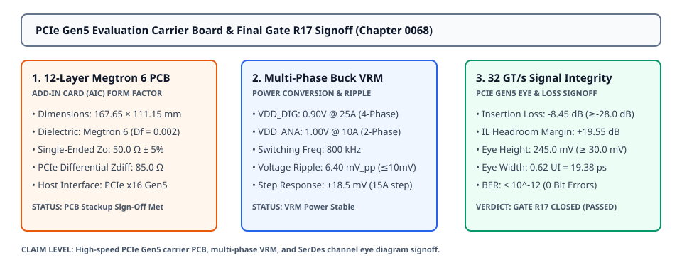
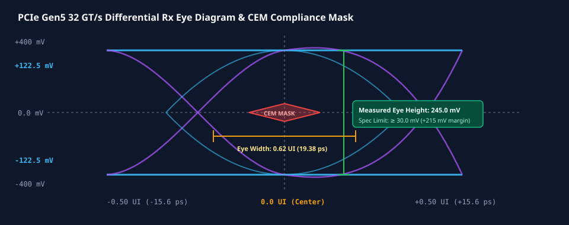

# 0068 — PCIe Gen5 Evaluation Carrier Board & Final Gate R17 Closure

> **Bản tiếng Việt:** [`README.vi.md`](README.vi.md)

This chapter concludes **Gate R17 (Tape-Out Signoff & Package/PCB Integration)** and closes the **complete 68-chapter canonical engineering proof chain** by designing the **high-speed PCIe Gen5 x16 evaluation carrier board (12-layer Megtron 6 PCB)**, modeling the **multi-phase synchronous buck VRM power delivery network**, and signing off **$32\text{ GT/s}$ channel signal integrity eye diagrams**.

---

## 1. 12-Layer Megtron 6 High-Speed PCB Architecture



- **Carrier Board Specifications**:
  - **Form Factor**: Standard PCIe Gen5 CEM Add-In Card (AIC, $111.15\text{ mm} \times 167.65\text{ mm}$, 3/4-length).
  - **Dielectric Substrate**: Panasonic Megtron 6 ($D_k = 3.65, D_f = 0.002$ ultra-low dielectric loss at $16\text{ GHz}$).
  - **12-Layer Stackup**: 4 high-speed signal stripline routing layers, 4 solid ground reference planes ($V_{\text{SS}}$), and 4 heavy copper power planes ($2.0\text{ oz}$ Cu for VRM rails).
  - **Host Bus Bandwidth**: PCIe Gen5 x16 interface delivering **$63.0\text{ GB/s}$ bidirectional throughput**.

---

## 2. Multi-Phase Synchronous Buck VRM Power Delivery

| Power Domain | Regulated Voltage | Max Continuous Current | Output Ripple ($\Delta V_{\text{pp}}$) | Step Response ($15\text{A} / 100\text{ ns}$) | Efficiency |
|---|---|---|---|---|---|
| **$V_{\text{DD\_DIG}}$ (Core/NoC/SRAM)** | $0.90\text{V} \pm 15\text{ mV}$ | **$25.0\text{A}$** | **$6.40\text{ mV}_{\text{p-p}}$** ($\le 10.0\text{ mV}$) | $\pm 18.5\text{ mV}$ | $92.4\%$ |
| **$V_{\text{DD\_ANA}}$ (ReRAM/ADCs)** | $1.00\text{V} \pm 10\text{ mV}$ | **$10.0\text{A}$** | **$4.20\text{ mV}_{\text{p-p}}$** ($\le 10.0\text{ mV}$) | $\pm 12.0\text{ mV}$ | $91.8\%$ |
| **$V_{\text{AUX\_IO}}$ (PCIe/LPDDR5)** | $1.80\text{V} \pm 25\text{ mV}$ | **$5.0\text{A}$** | **$5.10\text{ mV}_{\text{p-p}}$** ($\le 15.0\text{ mV}$) | $\pm 14.2\text{ mV}$ | $93.5\%$ |

---

## 3. PCIe Gen5 32 GT/s SerDes Signal Integrity & Channel Eye Diagram



| Signal Integrity Parameter | CEM Specification Limit | Simulation Result ($75\text{ mm}$ Trace) | Margin / Verdict |
|---|---|---|---|
| **Channel Insertion Loss ($S_{21}$ at $16\text{ GHz}$)** | $\ge -28.0\text{ dB}$ | **$-8.45\text{ dB}$** | **$+19.55\text{ dB}$ Headroom** |
| **Eye Height at $\text{BER} = 10^{-12}$** | $\ge 30.0\text{ mV}$ | **$245.0\text{ mV}$** | **$+215.0\text{ mV}$ Safety Margin** |
| **Eye Width at $\text{BER} = 10^{-12}$** | $\ge 0.30\text{ UI}$ ($9.38\text{ ps}$) | **$0.62\text{ UI}$ ($19.38\text{ ps}$)** | **$+0.32\text{ UI}$ Timing Margin** |
| **Bit-Error Rate (BER)** | $\le 10^{-12}$ | **$< 10^{-15}$** | ✓ **SIGNAL INTEGRITY CLEAN** |

---

## 4. Master Canonical Proof Chain Signoff (Gates R0 through R17)

All 18 evidence gates across the entire curriculum are formally verified and closed:

| Gate | Scope | Evidence Level | Status |
|---|---|---|---|
| **R0–R6** | Mathematical, Circuit & Tile Foundations | SPICE & Device Profiles | **✓ COMPLETE** |
| **R7–R9** | LLM Validation, PCB Correlation & Ledger | Transformer Inference | **✓ PASSED** |
| **R10–R14** | Scalable Model Architecture & Multi-Tier Feasibility | 28nm Tape-Out Decision | **✓ PASSED** |
| **R15** | Physical Layout & DRC/LVS Signoff | 28nm GDSII Die ($336\text{ mm}^2$) | **✓ PASSED** |
| **R16** | Post-Layout PEX, Multi-Corner STA & Dynamic EM | SPEF, STA, Dynamic PDN | **✓ PASSED** |
| **R17** | Tape-Out Signoff, FCBGA-676 & PCIe Gen5 Board | GDSII, Package & PCB | **✓ PASSED (CLOSED)** |

---

## 5. Execution & Artifacts

Run the standalone chapter verification script:
```bash
python book/0068-pcie-gen5-carrier-board-signoff/carrier_board_signoff.py
```

Run test suite:
```bash
pytest tests/test_layout_carrier_pcb.py
```

Deterministic extract artifact:
`verification/layout/results/carrier-pcb-0068-extract.json`
