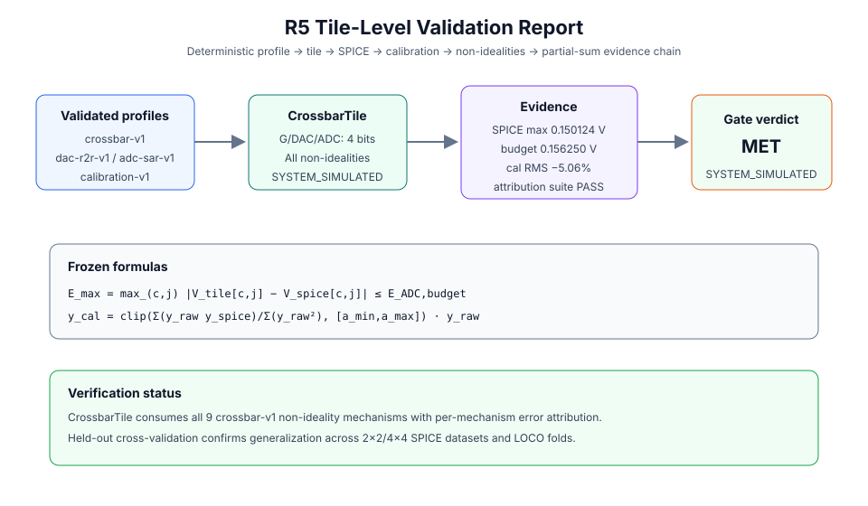

# tile-v1-r5-validation-summary

**Gate verdict: `MET`** — claim level `SYSTEM_SIMULATED`.



## Evidence chain

```text
crossbar/DAC/ADC profiles -> CrossbarTile -> 2x2/4x4 SPICE regression
                                      -> calibration profile (held-out CV)
                                      -> crossbar non-idealities + error attribution
                                      -> tiled partial-sum rules
                                      -> frozen R5 verdict
```

## Formulas

- tile/SPICE error: `$E_max = max_(c,j) |V_tile[c,j] - V_spice[c,j]|$`
- acceptance: `$E_max <= E_ADC_budget$`
- calibration: `$a_ls = sum(y_raw*y_spice)/sum(y_raw^2)$`; `$y_cal = clip(a_ls,[a_min,a_max])*y_raw$`
- partial sums: `$y_i = sum_(j=0)^(K_c-1) TileForward(W_ij,x_j)$`
- accumulator: `$B_acc >= B_ADC + ceil(log2(K_c))$`

## Deterministic evidence

| item | result | status |
| --- | --- | --- |
| 2×2/4×4 SPICE equivalence | 10 cases / 30 outputs; max 0.150124 V ≤ 0.156250 V | PASS |
| calibration (held-out CV) | RMS 0.079836 V → 0.075799 V (5.06%); LOCO CV -1.93% | PASS |
| error attribution | 4 canonical matrix suites evaluated; all 9 mechanisms attributed | PASS |
| partial sums | `B_acc >= B_adc + ceil(log2(K_c))`; Kc=16 requires 8 bits | PASS |

## Profile coverage

- crossbar fields: 35
- directly consumed configuration fields: drift_exponent_nu_max, drift_exponent_nu_min, g0_s, gscale_s_per_w, iv_non_linearity_beta, mvm_error_16x16_1ohm_pct, p_stuck_hrs, p_stuck_lrs, r_wire_ohm, sigma_prog_rel, sigma_read_rel, v_read_max_v
- unconsumed required fields: 0

## Gate criteria

| criterion | result |
| --- | --- |
| three_profile_configuration | PASS |
| small_array_spice_budget | PASS |
| profile_driven_calibration | PASS |
| partial_sum_rules_explicit | PASS |
| all_required_crossbar_nonidealities_consumed | PASS |
| per_mechanism_error_attribution_verified | PASS |

## Limitations

- `assumed_profile_parameters`: crossbar-v1 contains 12 assumed fields from literature; claim level remains SYSTEM_SIMULATED until replaced by verified device models.

## Verdict

R5 gate exit is MET (SYSTEM_SIMULATED): tile simulator is a calibrated abstraction of the converter and crossbar stack consuming all crossbar-v1 non-idealities with verified per-mechanism error attribution and held-out cross-validation.
